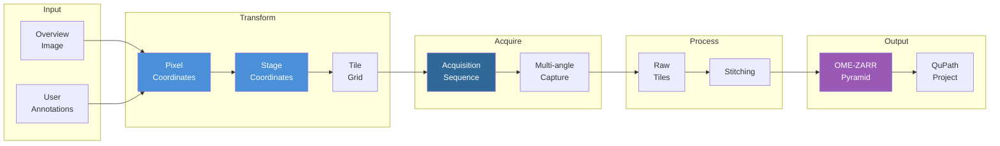
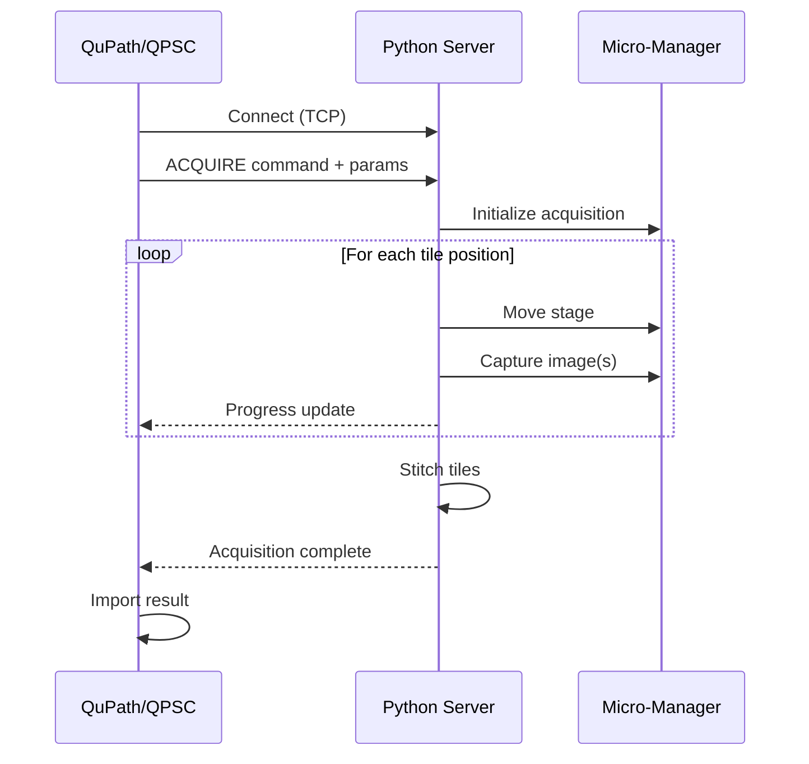

# QPSC - QuPath Scope Control

**Annotation-driven targeted microscopy acquisition from within QuPath**

QPSC bridges [QuPath](https://qupath.github.io/)'s digital pathology environment with automated microscope control via [Micro-Manager](https://micro-manager.org/) and [Pycro-Manager](https://pycro-manager.readthedocs.io/). Users define regions of interest in QuPath and automatically acquire high-resolution microscopy data at those locations.

---

**[→ Jump to Installation Instructions](#installation)**

---

## System Overview

> **Click any component** to navigate to its repository or documentation.

```mermaid
flowchart LR
    subgraph User["User Layer"]
        U[("Pathologist / Researcher")]
    end

    subgraph QuPath["QuPath Application"]
        QP["QuPath + QPSC Extension"]
        T2P["Tiles-to-Pyramid Extension"]
    end

    subgraph Python["Python Microscope Control"]
        SRV["Command Server"]
        CTRL["Hardware Control"]
        PPM["PPM Library"]
    end

    subgraph Hardware["Microscope"]
        HW[("Microscope Hardware")]
    end

    subgraph Bridge["Hardware Bridge"]
        PM["Pycro-Manager"]
        MM["Micro-Manager"]
    end

    U -->|"Define ROIs & Parameters"| QP
    QP ==>|"Socket Commands"| SRV
    SRV --> CTRL
    SRV --> PPM
    CTRL -->|"Python API"| PM
    PM -->|"Java Bridge"| MM
    MM -->|"Device Control"| HW

    HW -.->|"Images"| CTRL
    CTRL -.->|"Processing"| PPM
    PPM -.->|"Processed images and analysis"| SRV
    SRV -.->|"Raw tiles"| T2P
    T2P -.->|"Stitched OME-ZARR"| QP

    %% Add invisible spacing node for padding
    HW ~~~ SPACE[ ]
    style SPACE fill:none,stroke:none

    style QP fill:#4A90D9,color:#fff
    style T2P fill:#4A90D9,color:#fff
    style SRV fill:#306998,color:#fff
    style CTRL fill:#4A7DB8,color:#fff
    style PPM fill:#4A7DB8,color:#fff
    style PM fill:#E67E22,color:#fff
    style MM fill:#D35400,color:#fff
    style HW fill:#C0392B,color:#fff

    click QP "https://github.com/uw-loci/qupath-extension-qpsc" "QPSC Extension Repository"
    click T2P "https://github.com/uw-loci/qupath-extension-tiles-to-pyramid" "Tiles-to-Pyramid Extension Repository"
    click SRV "https://github.com/uw-loci/microscope_command_server" "Command Server Repository"
    click CTRL "https://github.com/uw-loci/microscope_control" "Hardware Control Repository"
    click PPM "https://github.com/uw-loci/ppm_library" "PPM Library Repository"
    click PM "https://pycro-manager.readthedocs.io/" "Pycro-Manager Documentation"
    click MM "https://micro-manager.org/" "Micro-Manager Website"
```



## Core Workflow

1. **Setup Coordinates** - Use known/estimated stage coordinates, or load an image from a slide scanner to enable mapping of stage coordinates to locations on the slide
2. **Define Regions** - Draw annotations on areas of interest
3. **Configure Acquisition** - Select imaging modality, objectives, and parameters
4. **Acquire** - The QPSC extension sends a workflow to the microscope command server to capture high-resolution tiles
5. **Stitch & Import** - Tiles are stitched in a QuPath extension into pyramidal images and imported into a QuPath project along with metadata for sorting the results

## Component Repositories

### QuPath Extensions

| Repository | Description | Language |
|------------|-------------|----------|
| [qupath-extension-qpsc](https://github.com/uw-loci/qupath-extension-qpsc) | Main QPSC QuPath extension - UI, workflows, coordinate transforms | Java |
| [qupath-extension-tiles-to-pyramid](https://github.com/uw-loci/qupath-extension-tiles-to-pyramid) | Stitches acquired tiles into pyramidal OME-ZARR images | Java |

### Python Microscope Control

| Repository | Description | Language |
|------------|-------------|----------|
| [microscope_command_server](https://github.com/uw-loci/microscope_command_server) | Socket server for QuPath-to-microscope communication and acquisition workflows | Python |
| [microscope_control](https://github.com/uw-loci/microscope_control) | Hardware abstraction layer via Pycromanager/Micro-Manager | Python |
| [ppm_library](https://github.com/uw-loci/ppm_library) | Image processing library for PPM and general microscopy imaging | Python |
| [microscope_configurations](https://github.com/uw-loci/microscope_configurations) | YAML configuration templates for microscope systems | YAML |

### Supporting Tools

| Repository | Description |
|------------|-------------|
| [qupath-extension-ocr4labels](https://github.com/MichaelSNelson/qupath-extension-ocr4labels) | OCR for slide label text extraction |
| [QuPath_Confusion_Matrix_Extension](https://github.com/kgallik/QuPath_Confusion_Matrix_Extension) | Classification validation tools |

## Architecture

QPSC uses a modular architecture with separate Python packages for different concerns:

- **QuPath Extensions** (Java) - User interface, workflows, coordinate transforms
- **Python Microscope Control** - Socket server, hardware abstraction, image processing
- **Micro-Manager Stack** - Hardware device control

For detailed architecture documentation including:
- Component structure and responsibilities
- Communication protocols
- Coordinate system transformations
- Modality system design
- Configuration hierarchy
- Threading and concurrency

See: **[docs/architecture.md](docs/architecture.md)**

## Imaging Modalities

QPSC supports multiple imaging modalities through a pluggable architecture:

| Modality | Description | Status |
|----------|-------------|--------|
| **PPM** (Polarized Light) | Multi-angle polarization microscopy for birefringent samples | Active |
| **Brightfield** | Standard transmitted light imaging | Active |
| **Fluorescence** | Multi-channel fluorescence (planned) | Planned |
| **SHG/Multiphoton** | Second harmonic generation imaging | Experimental |

## Installation

QPSC requires several components that work together. This section guides you through installing everything needed for annotation-driven microscopy acquisition.

### Prerequisites

Install these foundational components **in this order** before QPSC installation:

#### 1. Micro-Manager (Hardware Control)
- **Version**: 2.0+ (latest 2.0 gamma release recommended)
- **Purpose**: Controls microscope hardware via device adapters
- **Installation**: [Micro-Manager Download](https://micro-manager.org/Download_Micro-Manager_Latest_Release)
- **Configuration**: Configure device adapters for your specific hardware before proceeding
- **Note**: Must be installed and tested before Python packages

#### 2. QuPath (Digital Pathology Platform)
- **Version**: 0.6.0+
- **Purpose**: Annotation interface and image analysis environment
- **Installation**: [QuPath Download](https://qupath.github.io/)
- **Note**: Install before QPSC extensions

#### 3. Python (Microscope Control Server)
- **Version**: Python 3.10 or later (3.12 recommended)
- **Purpose**: Runtime for microscope control server
- **Installation**: [Python Download](https://www.python.org/downloads/)
- **Windows Note**: Check "Add Python to PATH" during installation

#### 4. Windows Media Feature Pack (Windows N/KN Editions Only)
- **Required for**: Windows N or KN editions (Education N, Pro N, etc.)
- **Purpose**: Provides media codecs required by OpenCV (autofocus functionality)
- **Symptom without it**: `ImportError: DLL load failed while importing cv2`
- **Installation**: [Media Feature Pack Download](https://support.microsoft.com/en-us/topic/media-feature-pack-list-for-windows-n-editions-c1c6fffa-d052-8338-7a79-a4bb980a700a)
- **Check if you need this**:
  - Open Settings → System → About
  - If "Edition" shows "Windows 10/11 Education N" or "Pro N", you need the Media Feature Pack
- **Note**: Standard Windows editions (Home, Pro, Education) already include these components

#### 5. Java Development Kit (For Extension Development Only)
- **Version**: Java 21+
- **Purpose**: Building QuPath extensions from source
- **Note**: Not required for using QPSC, only for modifying extension code
- **Installation**: [Adoptium Temurin](https://adoptium.net/)

---

### Automated Installation (Windows - Recommended)

**Best for most users** - Automated PowerShell script handles all Python package installation, QuPath extensions, and configuration templates.

#### Quick Start (Production Mode)

For users who want to use QPSC without modifying code:

**1. Open PowerShell** (Run as Administrator recommended)

**2. Navigate to your home directory** (avoid System32!):
```powershell
cd $env:USERPROFILE
```

**3. Download the setup script:**
```powershell
Invoke-WebRequest -Uri "https://raw.githubusercontent.com/uw-loci/QPSC/main/PPM-QuPath.ps1" -OutFile "PPM-QuPath.ps1"
```

**4. Run the setup script:**
```powershell
.\PPM-QuPath.ps1
```

**What this does:**
- Creates a Python virtual environment
- Installs Python packages from GitHub (latest versions, including prereleases)
- Installs OpenCV (required for autofocus)
- Downloads QPSC and Tiles-to-Pyramid extension JARs (shadow JARs with bundled dependencies)
- Stores extensions in local `QPSC\extensions\` folder for easy access
- Automatically copies extensions to QuPath user data directory
- Downloads configuration templates
- Creates a launcher script that opens server in visible window showing status

**Default installation location:** `C:\Users\YourUsername\QPSC\`

**Custom installation location:**
```powershell
.\PPM-QuPath.ps1 -InstallDir "D:\MyProjects\QPSC"
```

**Custom QuPath location** (if not auto-detected):
```powershell
.\PPM-QuPath.ps1 -QuPathDir "C:\path\to\QuPath-0.6.0"
```

> **Note:** The script automatically searches for QuPath in:
> - `%LOCALAPPDATA%\QuPath-*` (MSI installation default)
> - `%USERPROFILE%\QuPath` (portable installation)
> - `%ProgramFiles%\QuPath`
>
> If QuPath is in a different location, use the `-QuPathDir` parameter.

#### After Installation: Verify Your Setup

**The setup script creates a detailed installation summary file:**

```
%USERPROFILE%\QPSC\INSTALLATION_SUMMARY.txt
```

**This file contains:**
- Python environment location and activation commands
- Exact paths where packages were installed
- Verification commands to test your installation
- Troubleshooting tips for common issues

**Quick verification commands:**

All installations use a virtual environment located at `C:\Users\YourUsername\QPSC\venv_qpsc\`

```powershell
# Activate the virtual environment
C:\Users\YourUsername\QPSC\venv_qpsc\Scripts\Activate.ps1

# Check installed packages
pip list | Select-String "microscope|ppm"

# Test import
python -c "import microscope_command_server; print('Import OK')"
```

**Or use the venv Python directly without activation:**
```powershell
C:\Users\YourUsername\QPSC\venv_qpsc\Scripts\python.exe -c "import microscope_command_server; print('Import OK')"
```

Open the `INSTALLATION_SUMMARY.txt` file to see all available verification commands and troubleshooting steps!

---

#### Development Mode

For developers who want to modify QPSC code:

**Navigate to your home directory** (if you followed Quick Start above, you're already there):
```powershell
cd $env:USERPROFILE
```

**Download and run in development mode:**
```powershell
.\PPM-QuPath.ps1 -Development
```

**What this does:**
- Clones all 6 QPSC repositories
- Creates Python virtual environment
- Installs packages in editable mode (`pip install -e .`)
- Downloads QuPath extensions
- Sets up development environment

**Detailed setup script documentation:** [SETUP_SCRIPTS_README.md](SETUP_SCRIPTS_README.md)

---

### Manual Installation (All Platforms)

**When to use manual installation:**
- macOS or Linux systems
- Prefer manual control over installation process
- Need to customize installation steps
- Automated script fails or is unavailable

#### Prerequisites Check

Before starting, verify you have the required tools installed:

Check Python version (should show 3.10 or higher):
```bash
python --version
```

Check pip is available:
```bash
pip --version
```

Check git is available (for development mode):
```bash
git --version
```

#### Step 1: Create Python Virtual Environment (Recommended)

Using a virtual environment isolates QPSC dependencies from system Python:

**Windows:**

Navigate to an appropriate directory (e.g., your home directory):
```powershell
cd $env:USERPROFILE
```

Create virtual environment:
```powershell
python -m venv qpsc-env
```

Activate virtual environment:
```powershell
.\qpsc-env\Scripts\activate
```

Verify activation (should show path to venv):
```powershell
where python
```

**macOS/Linux:**

Navigate to an appropriate directory (e.g., your home directory):
```bash
cd ~
```

Create virtual environment:
```bash
python3 -m venv qpsc-env
```

Activate virtual environment:
```bash
source qpsc-env/bin/activate
```

Verify activation:
```bash
which python
```

> **Note:** You must activate the virtual environment each time you want to run the microscope server.

#### Step 2: Install Python Packages

**Critical: Installation Order Matters**

These packages have dependencies on each other and must be installed in this exact order:

**Option A: Install from GitHub (Users)**

Installs the latest released versions from GitHub.

**1. Install PPM Library** (no QPSC dependencies):
```bash
pip install git+https://github.com/uw-loci/ppm_library.git
```

**2. Install Microscope Control** (depends on ppm_library):
```bash
pip install git+https://github.com/uw-loci/microscope_control.git
```

**3. Install Microscope Command Server** (depends on both above):
```bash
pip install git+https://github.com/uw-loci/microscope_command_server.git
```

**Option B: Clone and Install Editable (Developers)**

For development and code modification.

Navigate to a parent directory for repositories:
```bash
cd /path/to/your/projects/
```

**Clone and install ppm_library:**
```bash
git clone https://github.com/uw-loci/ppm_library.git
cd ppm_library
pip install -e .
cd ..
```

**Clone and install microscope_control:**
```bash
git clone https://github.com/uw-loci/microscope_control.git
cd microscope_control
pip install -e .
cd ..
```

**Clone and install microscope_command_server:**
```bash
git clone https://github.com/uw-loci/microscope_command_server.git
cd microscope_command_server
pip install -e .
cd ..
```

**Verify installation:**
```bash
pip list | grep -E "(ppm-library|microscope-control|microscope-command-server)"
```

Expected output:
```
microscope-command-server    1.0.0    /path/to/microscope_command_server
microscope-control           1.0.0    /path/to/microscope_control
ppm-library                  1.0.0    /path/to/ppm_library
```

**Troubleshooting:** See [Python Package Installation Troubleshooting](#troubleshooting-python-package-installation) below.

#### Step 3: Install QuPath Extensions

Download the latest JAR files from GitHub releases:

1. **QPSC Extension** (main functionality)
   - Navigate to: [qupath-extension-qpsc/releases](https://github.com/uw-loci/qupath-extension-qpsc/releases)
   - Download: `qupath-extension-qpsc-[version].jar`

2. **Tiles-to-Pyramid Extension** (stitching)
   - Navigate to: [qupath-extension-tiles-to-pyramid/releases](https://github.com/uw-loci/qupath-extension-tiles-to-pyramid/releases)
   - Download: `qupath-extension-tiles-to-pyramid-[version].jar`

**Install extensions:**

Copy both JAR files to QuPath's extensions folder:

- **Windows (MSI install)**: `C:\Users\[YourUsername]\AppData\Local\QuPath-0.6.0\extensions\`
- **Windows (portable)**: `C:\Users\[YourUsername]\QuPath\extensions\`
- **macOS**: `~/Library/Application Support/QuPath/extensions/` or `~/QuPath/extensions/`
- **Linux**: `~/.local/share/QuPath/extensions/` or `~/QuPath/extensions/`

> **Tip:** In QuPath, go to `Edit > Preferences` and look at the "Extension directory" setting to find the exact path on your system.

**Verify installation:**
1. Launch QuPath
2. Go to `Extensions` menu
3. Look for `QPSC` menu entry

If you don't see QPSC in the Extensions menu, check:
- JAR files are in the correct extensions folder
- QuPath was restarted after copying JARs
- Check QuPath's log for any loading errors

#### Step 4: Download Configuration Templates

Configuration files tell the server about your microscope hardware.

**Download from GitHub:**

Navigate to [microscope_configurations](https://github.com/uw-loci/microscope_configurations) and download:

- `templates/config_template.yml` - Main microscope configuration
- `templates/autofocus_template.yml` - Autofocus parameters
- `templates/imageprocessing_template.yml` - Camera/exposure settings
- `resources/resources_LOCI.yml` - Hardware component lookup tables

**Save location:**
Create a `configurations` folder in your project directory, e.g.:
- Windows: `C:\QPSC\configurations\`
- macOS/Linux: `~/QPSC/configurations/`

**Edit for your hardware:**
1. Copy `config_template.yml` to a new file (e.g., `config_mymicroscope.yml`)
2. Edit device names, stage limits, objectives, etc. to match your hardware
3. See [Configuration Documentation](docs/configuration.md) for details

#### Step 5: Start the Microscope Server

Ensure Micro-Manager is running before starting the server.

**From command line:**
```bash
# Activate virtual environment (if using)
# Windows:
.\qpsc-env\Scripts\activate
# macOS/Linux:
source qpsc-env/bin/activate

# Start server
microscope-command-server
```

**Expected output:**
```
INFO - Loading generic startup configuration...
INFO - Initializing Micro-Manager connection...
INFO - Server listening on 0.0.0.0:5000
INFO - Ready for connections...
```

**Server is now ready!** You can connect from QuPath's QPSC extension.

To stop the server: Press `Ctrl+C`

---

### Detailed Component Installation Guides

For step-by-step instructions with screenshots and troubleshooting, see individual repository READMEs:

| Component | Repository | Installation Guide |
|-----------|------------|-------------------|
| **PPM Library** | [ppm_library](https://github.com/uw-loci/ppm_library) | [Installation](https://github.com/uw-loci/ppm_library#installation) |
| **Microscope Control** | [microscope_control](https://github.com/uw-loci/microscope_control) | [Installation](https://github.com/uw-loci/microscope_control#installation) |
| **Command Server** | [microscope_command_server](https://github.com/uw-loci/microscope_command_server) | [Installation](https://github.com/uw-loci/microscope_command_server#installation) |
| **Configuration Templates** | [microscope_configurations](https://github.com/uw-loci/microscope_configurations) | [Configuration Guide](https://github.com/uw-loci/microscope_configurations#usage) |
| **QPSC Extension** | [qupath-extension-qpsc](https://github.com/uw-loci/qupath-extension-qpsc) | [Extension Docs](https://github.com/uw-loci/qupath-extension-qpsc#installation) |
| **Stitching Extension** | [qupath-extension-tiles-to-pyramid](https://github.com/uw-loci/qupath-extension-tiles-to-pyramid) | [Extension Docs](https://github.com/uw-loci/qupath-extension-tiles-to-pyramid#installation) |

---

### Troubleshooting QuPath Installation

#### Problem: Setup script reports "QuPath not found"

**Cause:** QuPath is installed in a non-standard location or not installed.

**Solution:**

1. **Verify QuPath is installed:**
   - Look for QuPath in your Start Menu (Windows) or Applications folder (macOS)
   - Or download from: https://qupath.github.io/

2. **Find your QuPath installation directory:**
   - **Windows MSI install:** Usually `C:\Users\YourUsername\AppData\Local\QuPath-0.6.0\`
   - **Windows portable:** Could be anywhere you extracted it
   - **macOS:** `/Applications/QuPath.app` or `~/Applications/QuPath.app`

3. **Re-run setup script with QuPath location:**
   ```powershell
   .\PPM-QuPath.ps1 -QuPathDir "C:\Users\YourUsername\AppData\Local\QuPath-0.6.0"
   ```

4. **Or skip QuPath setup and install extensions manually:**
   ```powershell
   .\PPM-QuPath.ps1 -SkipQuPath
   ```
   Then follow [Step 3: Install QuPath Extensions](#step-3-install-qupath-extensions) to install manually.

#### Problem: Can't find QuPath extensions directory

**Solution:**

1. Launch QuPath
2. Go to `Edit > Preferences`
3. Look for "Extension directory" - this shows the exact path
4. Copy JARs to that directory
5. Restart QuPath

Common locations:
- **Windows MSI:** `%LOCALAPPDATA%\QuPath-0.6.0\extensions\`
- **Windows portable:** `%USERPROFILE%\QuPath\extensions\`
- **macOS:** `~/Library/Application Support/QuPath/extensions/`
- **Linux:** `~/.local/share/QuPath/extensions/`

---

### Troubleshooting Python Package Installation

#### Problem: `ModuleNotFoundError` when importing packages

**Cause:** Packages not installed or installation failed.

**Symptoms:**
```python
>>> import ppm_library
ModuleNotFoundError: No module named 'ppm_library'
```

**Solution:**

1. **Verify packages are installed:**
   ```powershell
   # Activate venv (if using one)
   C:\Users\YourUsername\QPSC\venv_qpsc\Scripts\Activate.ps1

   # Check installed packages
   pip list | Select-String "microscope|ppm"
   ```

2. **If packages are missing, reinstall in dependency order:**
   ```powershell
   pip install git+https://github.com/uw-loci/ppm_library.git
   pip install git+https://github.com/uw-loci/microscope_control.git
   pip install git+https://github.com/uw-loci/microscope_command_server.git
   ```

3. **For development installations (editable mode):**
   ```bash
   cd /path/to/repositories
   pip install -e ppm_library/
   pip install -e microscope_control/
   pip install -e microscope_command_server/
   ```

4. **Test imports:**
   ```python
   python -c "import ppm_library, microscope_control, microscope_command_server; print('All imports OK')"
   ```

#### Problem: `UnicodeEncodeError` in server logs

**Cause:** Unicode characters in logging strings (Windows cp1252 encoding limitation).

**Solution:** This has been fixed in recent code - update to latest version:
```bash
cd microscope_command_server
git pull
```

The codebase now uses ASCII-only characters in all logging and internal strings.

#### Problem: Circular dependency importing ppm_library

**Cause:** `ppm_library/__init__.py` imports from `microscope_control`.

**Solution:** This has been fixed. Update `ppm_library/__init__.py` to remove the problematic import on line 39:
```python
# REMOVE this line:
from microscope_control.autofocus.tissue_detection import EmptyRegionDetector
```

#### Problem: OpenCV (cv2) import errors

QPSC requires OpenCV for autofocus functionality. There are two common OpenCV issues:

**Issue 1: OpenCV not installed**

**Symptoms:**
```
ModuleNotFoundError: No module named 'cv2'
```

**Solution:**
```bash
pip install opencv-python
```

**Issue 2: OpenCV DLL loading error on Windows N editions**

**Symptoms:**
```
ImportError: DLL load failed while importing cv2: The specified module could not be found.
```

**Cause:** Windows N editions (Education N, Pro N, Home N) do not include media components required by OpenCV.

**Solution:**

1. **Check your Windows edition:**
   - Open Settings → System → About
   - Look at "Edition" - if it ends with "N" (e.g., "Windows 10 Education N"), you need the Media Feature Pack

2. **Install Media Feature Pack:**
   - Download from: [Media Feature Pack for Windows N editions](https://support.microsoft.com/en-us/topic/media-feature-pack-list-for-windows-n-editions-c1c6fffa-d052-8338-7a79-a4bb980a700a)
   - Follow Microsoft's installation instructions
   - Restart your computer after installation

3. **Verify OpenCV works:**
   ```powershell
   python -c "import cv2; print('OpenCV version:', cv2.__version__)"
   ```

**Note:** If you're using conda-based Python, you can alternatively install opencv via conda which bundles all necessary DLLs:
```bash
conda install -c conda-forge opencv
```

#### Problem: Port 5000 already in use

**Symptoms:**
```
OSError: [Errno 48] Address already in use
```

**Cause:** Another server instance or application is using port 5000.

**Solution:**
```bash
# Find process using port 5000
# Windows:
netstat -ano | findstr :5000
# macOS/Linux:
lsof -i :5000

# Kill the process if safe, or change server port in code
```

---

### Post-Installation Verification

After installation, verify everything works:

#### 1. Test Python Package Imports
```python
python -c "import ppm_library, microscope_control, microscope_command_server; print('All packages imported successfully')"
```

#### 2. Test Server Startup
```bash
# Start Micro-Manager first
# Then start server
microscope-command-server
```

Expected: Server should start and show "Server listening on 0.0.0.0:5000"

#### 3. Test QuPath Extension
1. Launch QuPath
2. Go to `Extensions > QPSC`
3. You should see menu options for workflows

#### 4. Test Full Workflow
See [Usage Guide](docs/usage.md) for a complete workflow walkthrough

---

### Uninstallation

To remove QPSC components for a clean reinstallation or complete uninstall, see the [Uninstallation Guide](UNINSTALL.md).

---

## Configuration

QPSC uses YAML configuration files for microscope-specific settings:

```yaml
# Example: config_ppm.yml
microscope:
  name: "PPM Microscope"
  stage:
    type: "ASI"
    limits:
      x: [-50000, 50000]
      y: [-50000, 50000]

modalities:
  ppm_20x:
    objective: "20x"
    angles: [0, 45, 90, 135]
    exposure_ms: 50
```

See [Configuration Documentation](docs/configuration.md) for full details.

## Data Flow



## Development

### Building from Source

```bash
# Clone the main extension
git clone https://github.com/uw-loci/qupath-extension-qpsc.git
cd qupath-extension-qpsc

# Build (requires Java 21+)
./gradlew build

# Run tests
./gradlew test
```

### Project Structure

```
QPSC Repositories (Modular Architecture)/

QuPath Extensions:
├── qupath-extension-qpsc/           # Main QPSC extension
│   ├── src/main/java/qupath/ext/qpsc/
│   │   ├── controller/              # Workflow orchestration
│   │   ├── modality/                # Imaging mode plugins
│   │   ├── service/                 # Socket communication
│   │   ├── ui/                      # JavaFX dialogs
│   │   └── utilities/               # Coordinate transforms, config
│   └── build.gradle
└── qupath-extension-tiles-to-pyramid/  # Image stitching

Python Microscope Control (pip-installable packages):
├── microscope_command_server/       # Package: microscope-command-server
│   ├── server/
│   │   ├── qp_server.py            # Socket server
│   │   └── protocol.py             # Communication protocol
│   ├── acquisition/
│   │   ├── workflow.py             # Acquisition orchestration
│   │   ├── tiles.py                # Tile grid utilities
│   │   └── pipeline.py             # Processing pipeline
│   ├── client/
│   │   └── client.py               # Python client library
│   └── pyproject.toml
│
├── microscope_control/              # Package: microscope-control
│   ├── hardware/
│   │   ├── base.py                 # Hardware abstraction
│   │   └── pycromanager.py         # Micro-Manager integration
│   ├── autofocus/
│   │   ├── core.py                 # Autofocus algorithms
│   │   └── metrics.py              # Focus quality metrics
│   ├── config/
│   │   └── manager.py              # YAML config management
│   └── pyproject.toml
│
├── ppm_library/                     # Package: ppm-library
│   ├── ppm/
│   │   └── calibration.py          # PPM calibration
│   ├── imaging/
│   │   ├── background.py           # Background correction
│   │   ├── tissue_detection.py     # Empty region detection
│   │   └── writer.py               # TIFF I/O
│   ├── debayering/
│   │   ├── cpu.py                  # CPU debayering
│   │   └── gpu.py                  # GPU debayering
│   └── pyproject.toml
│
└── microscope_configurations/       # YAML configuration templates
    ├── config_template.yml
    ├── autofocus_template.yml
    ├── imageprocessing_template.yml
    ├── config_PPM.yml              # Example PPM config
    ├── config_CAMM.yml             # Example CAMM config
    └── resources/                  # Hardware resource definitions
```

**Dependency Chain:**
```
microscope_configurations (runtime config files)
         ↓
    ┌────┴────┐
    ↓         ↓
microscope_control  ppm_library (standalone)
    ↓         ↓
    └────┬────┘
         ↓
microscope_command_server
```

## Communication Protocol

QPSC uses a socket-based protocol for communication between QuPath and the Python server:



## Contributing

We welcome contributions! Please see individual repository guidelines:

**QuPath Extensions:**
- [QPSC Extension Contributing Guide](https://github.com/uw-loci/qupath-extension-qpsc/blob/main/CONTRIBUTING.md)
- [Tiles-to-Pyramid Extension](https://github.com/uw-loci/qupath-extension-tiles-to-pyramid)

**Python Microscope Control:**
- [Microscope Command Server Issues](https://github.com/uw-loci/microscope_command_server/issues)
- [Microscope Control Issues](https://github.com/uw-loci/microscope_control/issues)
- [PPM Library Issues](https://github.com/uw-loci/ppm_library/issues)
- [Configuration Templates](https://github.com/uw-loci/microscope_configurations/issues)

## Publications & Citations

If you use QPSC in your research, please cite:

> [Citation information to be added]

## License

Components are licensed individually - see each repository for details.

## Acknowledgments

QPSC is developed at the [Laboratory for Optical and Computational Instrumentation (LOCI)](https://loci.wisc.edu/) at the University of Wisconsin-Madison.

- [QuPath](https://qupath.github.io/) - Open source software for bioimage analysis
- [Micro-Manager](https://micro-manager.org/) - Open source microscopy software
- [Pycro-Manager](https://pycro-manager.readthedocs.io/) - Python interface for Micro-Manager

---

**Questions?** Open an issue in the relevant repository or contact the LOCI team.
