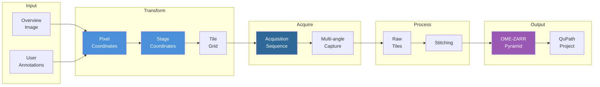
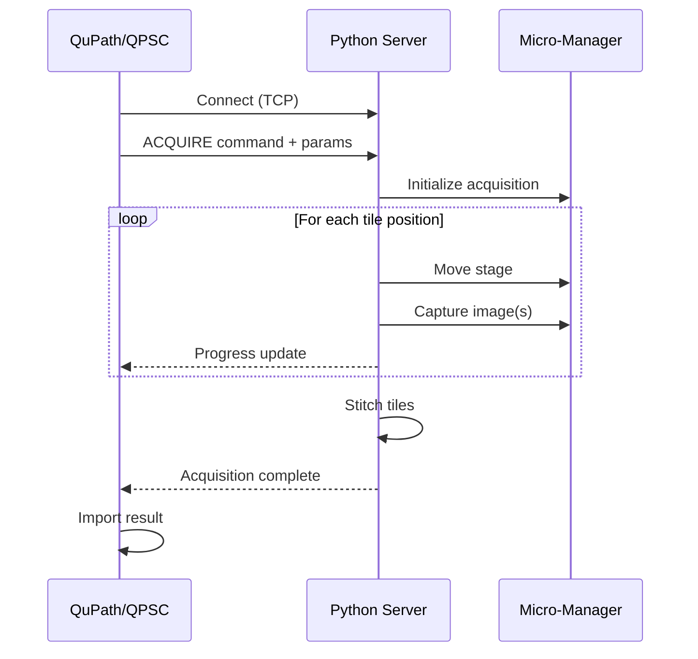

# QPSC - QuPath Scope Control

**Annotation-driven targeted microscopy acquisition from within QuPath**

QPSC bridges [QuPath](https://qupath.github.io/)'s digital pathology environment with automated microscope control via [Micro-Manager](https://micro-manager.org/) and [Pycro-Manager](https://pycro-manager.readthedocs.io/). Users define regions of interest in QuPath and automatically acquire high-resolution microscopy data at those locations.

## System Overview

> **Click any component** to navigate to its repository or documentation.

```mermaid
flowchart LR
    subgraph User["User Layer"]
        U[("Pathologist / Researcher")]
    end

    subgraph QuPath["QuPath Application"]
        QP["QuPath + QPSC Extension"]
        T2P["Tiles-to-Pyramid Extension"]
    end

    subgraph Python["Python Microscope Control"]
        SRV["Command Server"]
        CTRL["Hardware Control"]
        PPM["PPM Library"]
    end

    subgraph Hardware["Microscope"]
        HW[("Microscope Hardware")]
    end

    subgraph Bridge["Hardware Bridge"]
        PM["Pycro-Manager"]
        MM["Micro-Manager"]
    end

    U -->|"Define ROIs & Parameters"| QP
    QP ==>|"Socket Commands"| SRV
    SRV --> CTRL
    SRV --> PPM
    CTRL -->|"Python API"| PM
    PM -->|"Java Bridge"| MM
    MM -->|"Device Control"| HW

    HW -.->|"Images"| CTRL
    CTRL -.->|"Processing"| PPM
    PPM -.->|"Processed images and analysis"| SRV
    SRV -.->|"Raw tiles"| T2P
    T2P -.->|"Stitched OME-ZARR"| QP

    %% Add invisible spacing node for padding
    HW ~~~ SPACE[ ]
    style SPACE fill:none,stroke:none

    style QP fill:#4A90D9,color:#fff
    style T2P fill:#4A90D9,color:#fff
    style SRV fill:#306998,color:#fff
    style CTRL fill:#4A7DB8,color:#fff
    style PPM fill:#4A7DB8,color:#fff
    style PM fill:#E67E22,color:#fff
    style MM fill:#D35400,color:#fff
    style HW fill:#C0392B,color:#fff

    click QP "https://github.com/uw-loci/qupath-extension-qpsc" "QPSC Extension Repository"
    click T2P "https://github.com/uw-loci/qupath-extension-tiles-to-pyramid" "Tiles-to-Pyramid Extension Repository"
    click SRV "https://github.com/uw-loci/microscope_command_server" "Command Server Repository"
    click CTRL "https://github.com/uw-loci/microscope_control" "Hardware Control Repository"
    click PPM "https://github.com/uw-loci/ppm_library" "PPM Library Repository"
    click PM "https://pycro-manager.readthedocs.io/" "Pycro-Manager Documentation"
    click MM "https://micro-manager.org/" "Micro-Manager Website"
```



## Core Workflow

1. **Setup Coordinates** - Use known/estimated stage coordinates, or load an image from a slide scanner to enable mapping of stage coordinates to locations on the slide
2. **Define Regions** - Draw annotations on areas of interest
3. **Configure Acquisition** - Select imaging modality, objectives, and parameters
4. **Acquire** - QPSC sends a workflow to the microscope to capture high-resolution tiles
5. **Stitch & Import** - Tiles are stitched in a QuPath extension into pyramidal images and imported into a QuPath project along with metadata for sorting the results

## Component Repositories

### QuPath Extensions

| Repository | Description | Language |
|------------|-------------|----------|
| [qupath-extension-qpsc](https://github.com/uw-loci/qupath-extension-qpsc) | Main QPSC QuPath extension - UI, workflows, coordinate transforms | Java |
| [qupath-extension-tiles-to-pyramid](https://github.com/uw-loci/qupath-extension-tiles-to-pyramid) | Stitches acquired tiles into pyramidal OME-ZARR images | Java |

### Python Microscope Control

| Repository | Description | Language |
|------------|-------------|----------|
| [microscope_command_server](https://github.com/uw-loci/microscope_command_server) | Socket server for QuPath-to-microscope communication and acquisition workflows | Python |
| [microscope_control](https://github.com/uw-loci/microscope_control) | Hardware abstraction layer via Pycromanager/Micro-Manager | Python |
| [ppm_library](https://github.com/uw-loci/ppm_library) | Image processing library for PPM and general microscopy imaging | Python |
| [microscope_configurations](https://github.com/uw-loci/microscope_configurations) | YAML configuration templates for microscope systems | YAML |

### Supporting Tools

| Repository | Description |
|------------|-------------|
| [qupath-extension-ocr4labels](https://github.com/MichaelSNelson/qupath-extension-ocr4labels) | OCR for slide label text extraction |
| [QuPath_Confusion_Matrix_Extension](https://github.com/kgallik/QuPath_Confusion_Matrix_Extension) | Classification validation tools |

## Architecture

QPSC uses a modular architecture with separate Python packages for different concerns:

- **QuPath Extensions** (Java) - User interface, workflows, coordinate transforms
- **Python Microscope Control** - Socket server, hardware abstraction, image processing
- **Micro-Manager Stack** - Hardware device control

For detailed architecture documentation including:
- Component structure and responsibilities
- Communication protocols
- Coordinate system transformations
- Modality system design
- Configuration hierarchy
- Threading and concurrency

See: **[docs/architecture.md](docs/architecture.md)**

## Imaging Modalities

QPSC supports multiple imaging modalities through a pluggable architecture:

| Modality | Description | Status |
|----------|-------------|--------|
| **PPM** (Polarized Light) | Multi-angle polarization microscopy for birefringent samples | Active |
| **Brightfield** | Standard transmitted light imaging | Active |
| **Fluorescence** | Multi-channel fluorescence (planned) | Planned |
| **SHG/Multiphoton** | Second harmonic generation imaging | Experimental |

## Quick Start

### Prerequisites

- [QuPath](https://qupath.github.io/) 0.6.0+
- [Micro-Manager](https://micro-manager.org/) 2.0+
- Python 3.9+
- Java 21+ (for development only)

### Automated Installation (Windows)

**Recommended for most users:**

We provide PowerShell setup scripts for automated installation:

- **`PPM-QuPath.ps1`** - Production setup (downloads pre-built binaries)
- **`PPM-QuPath-dev.ps1`** - Development setup (clones all source repositories)

**Usage:**
```powershell
# Download the setup script
Invoke-WebRequest -Uri "https://raw.githubusercontent.com/uw-loci/QPSC/main/PPM-QuPath.ps1" -OutFile "PPM-QuPath.ps1"

# Run the setup script
.\PPM-QuPath.ps1
```

See [SETUP_SCRIPTS_README.md](SETUP_SCRIPTS_README.md) for detailed instructions and parameters.

### Manual Installation

#### 1. Install QuPath Extensions

**IMPORTANT:** QuPath extensions must be manually downloaded and installed.

- Download latest JAR files from releases:
  - [qupath-extension-qpsc releases](https://github.com/uw-loci/qupath-extension-qpsc/releases)
  - [qupath-extension-tiles-to-pyramid releases](https://github.com/uw-loci/qupath-extension-tiles-to-pyramid/releases)
- Place JAR files in QuPath's `extensions` folder (typically `C:\Users\YourName\QuPath\extensions`)

#### 2. Set Up Python Microscope Control

```bash
# Install all microscope control packages
pip install microscope-server

# This automatically installs dependencies:
# - microscope-control (hardware abstraction)
# - ppm-library (image processing)
```

**For development:**
```bash
git clone https://github.com/uw-loci/ppm_library.git
git clone https://github.com/uw-loci/microscope_control.git
git clone https://github.com/uw-loci/microscope_command_server.git

pip install -e ppm_library/
pip install -e microscope_control/
pip install -e microscope_command_server/
```

#### 3. Configure Microscope

**IMPORTANT:** Configuration files must be manually created for your specific hardware.

```bash
# Download configuration templates
git clone https://github.com/uw-loci/microscope_configurations.git
cd microscope_configurations

# Copy and edit templates for your microscope
cp config_template.yml config_my_microscope.yml
# Edit config_my_microscope.yml with your hardware settings
```

See [Configuration Guide](docs/configuration.md) for details on configuring your specific hardware.

#### 4. Set Up Micro-Manager

- Install [Micro-Manager 2.0+](https://micro-manager.org/)
- Configure device adapters for your microscope hardware
- Test hardware connectivity in Micro-Manager GUI

#### 5. Launch QPSC

```bash
# Start the microscope server
microscope-server

# In a separate terminal or window:
# Start QuPath and access QPSC from Extensions > QPSC menu
```

## Configuration

QPSC uses YAML configuration files for microscope-specific settings:

```yaml
# Example: config_ppm.yml
microscope:
  name: "PPM Microscope"
  stage:
    type: "ASI"
    limits:
      x: [-50000, 50000]
      y: [-50000, 50000]

modalities:
  ppm_20x:
    objective: "20x"
    angles: [0, 45, 90, 135]
    exposure_ms: 50
```

See [Configuration Documentation](docs/configuration.md) for full details.

## Data Flow



## Development

### Building from Source

```bash
# Clone the main extension
git clone https://github.com/uw-loci/qupath-extension-qpsc.git
cd qupath-extension-qpsc

# Build (requires Java 21+)
./gradlew build

# Run tests
./gradlew test
```

### Project Structure

```
QPSC Repositories (Modular Architecture)/

QuPath Extensions:
├── qupath-extension-qpsc/           # Main QPSC extension
│   ├── src/main/java/qupath/ext/qpsc/
│   │   ├── controller/              # Workflow orchestration
│   │   ├── modality/                # Imaging mode plugins
│   │   ├── service/                 # Socket communication
│   │   ├── ui/                      # JavaFX dialogs
│   │   └── utilities/               # Coordinate transforms, config
│   └── build.gradle
└── qupath-extension-tiles-to-pyramid/  # Image stitching

Python Microscope Control (pip-installable packages):
├── microscope_command_server/       # Package: microscope-server
│   ├── server/
│   │   ├── qp_server.py            # Socket server
│   │   └── protocol.py             # Communication protocol
│   ├── acquisition/
│   │   ├── workflow.py             # Acquisition orchestration
│   │   ├── tiles.py                # Tile grid utilities
│   │   └── pipeline.py             # Processing pipeline
│   ├── client/
│   │   └── client.py               # Python client library
│   └── pyproject.toml
│
├── microscope_control/              # Package: microscope-control
│   ├── hardware/
│   │   ├── base.py                 # Hardware abstraction
│   │   └── pycromanager.py         # Micro-Manager integration
│   ├── autofocus/
│   │   ├── core.py                 # Autofocus algorithms
│   │   └── metrics.py              # Focus quality metrics
│   ├── config/
│   │   └── manager.py              # YAML config management
│   └── pyproject.toml
│
├── ppm_library/                     # Package: ppm-library
│   ├── ppm/
│   │   └── calibration.py          # PPM calibration
│   ├── imaging/
│   │   ├── background.py           # Background correction
│   │   ├── tissue_detection.py     # Empty region detection
│   │   └── writer.py               # TIFF I/O
│   ├── debayering/
│   │   ├── cpu.py                  # CPU debayering
│   │   └── gpu.py                  # GPU debayering
│   └── pyproject.toml
│
└── microscope_configurations/       # YAML configuration templates
    ├── config_template.yml
    ├── autofocus_template.yml
    ├── imageprocessing_template.yml
    ├── config_PPM.yml              # Example PPM config
    ├── config_CAMM.yml             # Example CAMM config
    └── resources/                  # Hardware resource definitions
```

**Dependency Chain:**
```
microscope_configurations (runtime config files)
         ↓
    ┌────┴────┐
    ↓         ↓
microscope_control  ppm_library (standalone)
    ↓         ↓
    └────┬────┘
         ↓
microscope_command_server
```

## Communication Protocol

QPSC uses a socket-based protocol for communication between QuPath and the Python server:



## Contributing

We welcome contributions! Please see individual repository guidelines:

**QuPath Extensions:**
- [QPSC Extension Contributing Guide](https://github.com/uw-loci/qupath-extension-qpsc/blob/main/CONTRIBUTING.md)
- [Tiles-to-Pyramid Extension](https://github.com/uw-loci/qupath-extension-tiles-to-pyramid)

**Python Microscope Control:**
- [Microscope Command Server Issues](https://github.com/uw-loci/microscope_command_server/issues)
- [Microscope Control Issues](https://github.com/uw-loci/microscope_control/issues)
- [PPM Library Issues](https://github.com/uw-loci/ppm_library/issues)
- [Configuration Templates](https://github.com/uw-loci/microscope_configurations/issues)

## Publications & Citations

If you use QPSC in your research, please cite:

> [Citation information to be added]

## License

Components are licensed individually - see each repository for details.

## Acknowledgments

QPSC is developed at the [Laboratory for Optical and Computational Instrumentation (LOCI)](https://loci.wisc.edu/) at the University of Wisconsin-Madison.

- [QuPath](https://qupath.github.io/) - Open source software for bioimage analysis
- [Micro-Manager](https://micro-manager.org/) - Open source microscopy software
- [Pycro-Manager](https://pycro-manager.readthedocs.io/) - Python interface for Micro-Manager

---

**Questions?** Open an issue in the relevant repository or contact the LOCI team.
