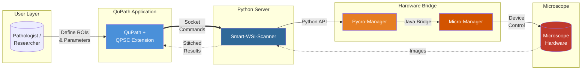
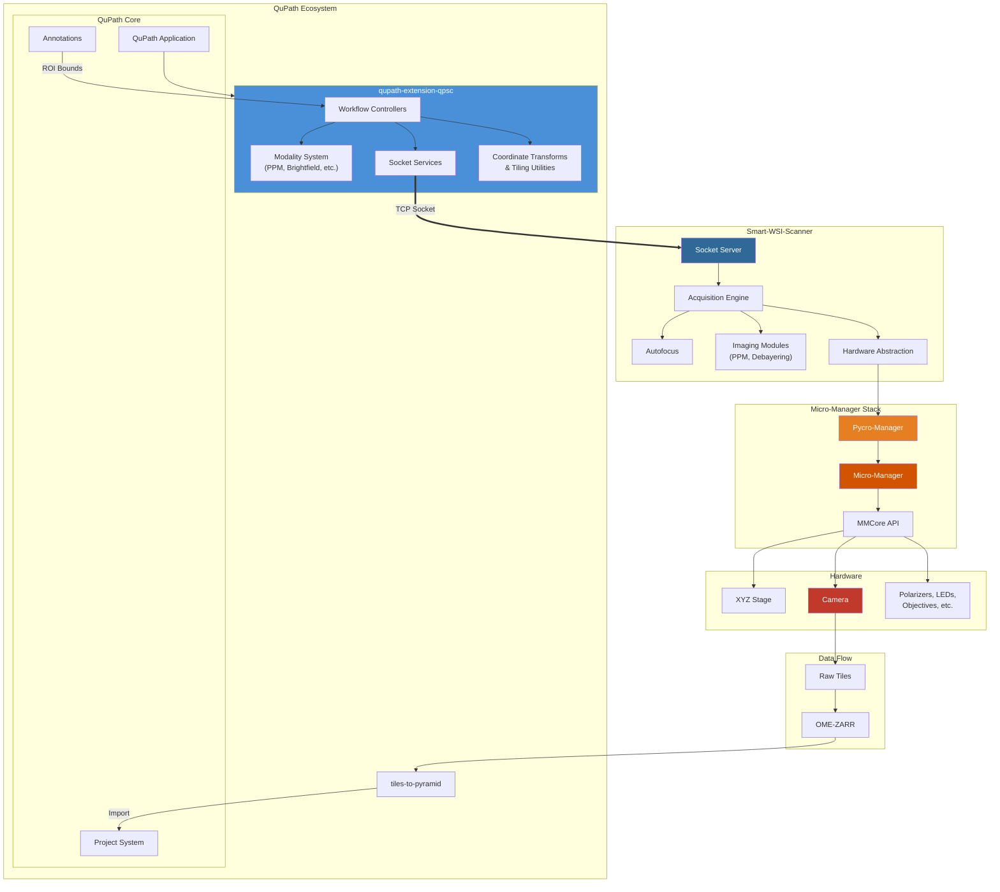
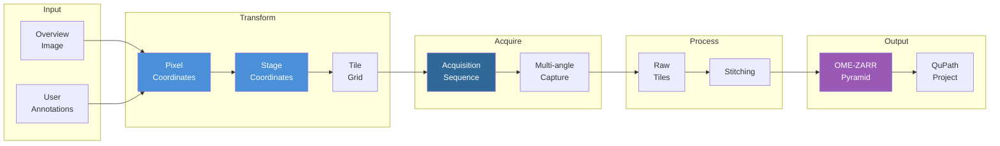
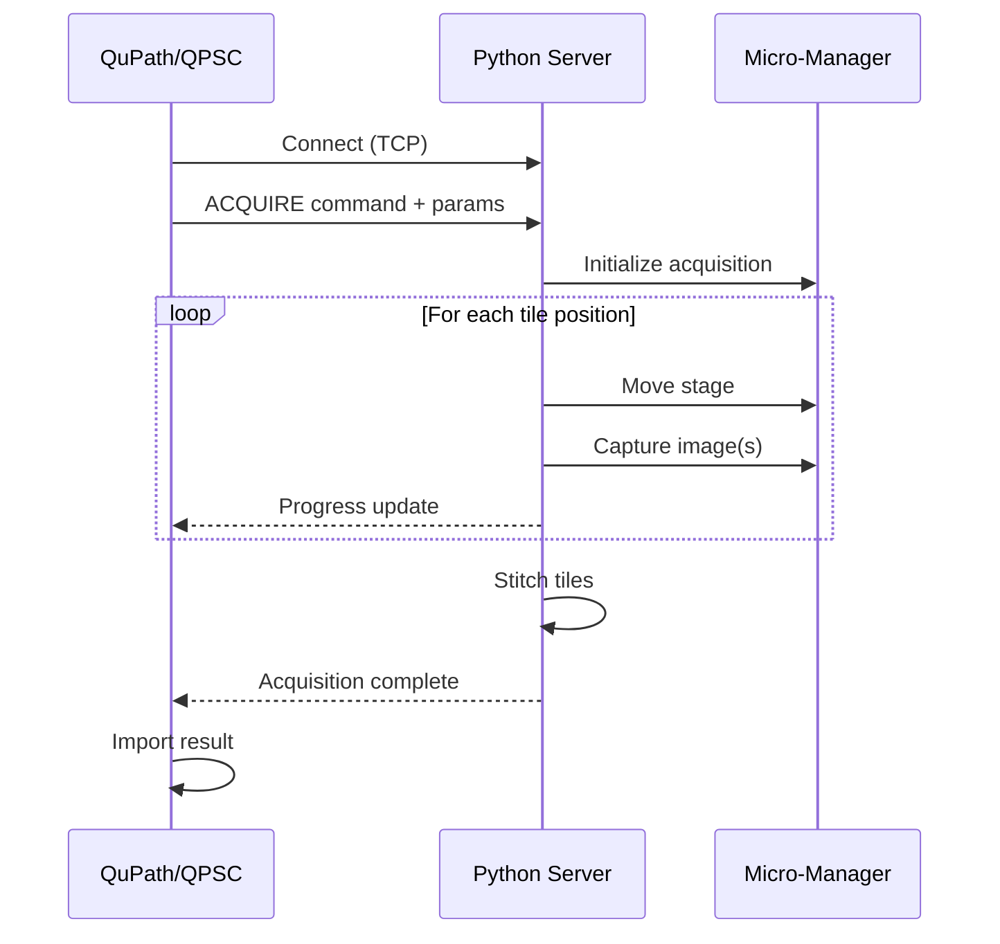

# QPSC - QuPath Scope Control

**Annotation-driven targeted microscopy acquisition from within QuPath**

QPSC bridges [QuPath](https://qupath.github.io/)'s digital pathology environment with automated microscope control via [Micro-Manager](https://micro-manager.org/) and [Pycro-Manager](https://pycro-manager.readthedocs.io/). Users define regions of interest in QuPath and automatically acquire high-resolution microscopy data at those locations.

## System Overview



## Core Workflow

1. **Load Overview Image** - Import a low-magnification slide scan into QuPath
2. **Define Regions** - Draw annotations on areas of interest
3. **Configure Acquisition** - Select imaging modality, objectives, and parameters
4. **Acquire** - QPSC coordinates with the microscope to capture high-resolution tiles
5. **Stitch & Import** - Tiles are stitched into pyramidal images and imported back to QuPath

## Component Repositories

| Repository | Description | Language |
|------------|-------------|----------|
| [qupath-extension-qpsc](https://github.com/uw-loci/qupath-extension-qpsc) | Main QPSC QuPath extension - UI, workflows, coordinate transforms | Java |
| [smart-wsi-scanner](https://github.com/JenuC/smart-wsi-scanner) | Python server for microscope control and image acquisition | Python |
| [qupath-extension-tiles-to-pyramid](https://github.com/uw-loci/qupath-extension-tiles-to-pyramid) | Stitches acquired tiles into pyramidal OME-ZARR images | Java |

### Supporting Tools

| Repository | Description |
|------------|-------------|
| [qupath-extension-ocr4labels](https://github.com/MichaelSNelson/qupath-extension-ocr4labels) | OCR for slide label text extraction |
| [QuPath_Confusion_Matrix_Extension](https://github.com/kgallik/QuPath_Confusion_Matrix_Extension) | Classification validation tools |

## Architecture



## Imaging Modalities

QPSC supports multiple imaging modalities through a pluggable architecture:

| Modality | Description | Status |
|----------|-------------|--------|
| **PPM** (Polarized Light) | Multi-angle polarization microscopy for birefringent samples | Active |
| **Brightfield** | Standard transmitted light imaging | Active |
| **Fluorescence** | Multi-channel fluorescence (planned) | Planned |
| **SHG/Multiphoton** | Second harmonic generation imaging | Experimental |

## Quick Start

### Prerequisites

- [QuPath](https://qupath.github.io/) 0.5.0+
- [Micro-Manager](https://micro-manager.org/) 2.0+
- Python 3.9+
- Java 21+

### Installation

1. **Install QuPath Extensions**
   - Download latest releases from each extension repository
   - Place JAR files in QuPath's `extensions` folder

2. **Set Up Python Server**
   ```bash
   git clone https://github.com/JenuC/smart-wsi-scanner.git
   cd smart-wsi-scanner
   pip install -r requirements.txt
   ```

3. **Configure Microscope**
   - Create configuration YAML files (see [Configuration Guide](docs/configuration.md))
   - Set up Micro-Manager device adapters for your hardware

4. **Launch**
   - Start Micro-Manager
   - Start the Python server: `python src/smart_wsi_scanner/qp_server.py`
   - Open QuPath and access QPSC from Extensions menu

## Configuration

QPSC uses YAML configuration files for microscope-specific settings:

```yaml
# Example: config_ppm.yml
microscope:
  name: "PPM Microscope"
  stage:
    type: "ASI"
    limits:
      x: [-50000, 50000]
      y: [-50000, 50000]

modalities:
  ppm_20x:
    objective: "20x"
    angles: [0, 45, 90, 135]
    exposure_ms: 50
```

See [Configuration Documentation](docs/configuration.md) for full details.

## Data Flow



## Development

### Building from Source

```bash
# Clone the main extension
git clone https://github.com/uw-loci/qupath-extension-qpsc.git
cd qupath-extension-qpsc

# Build (requires Java 21+)
./gradlew build

# Run tests
./gradlew test
```

### Project Structure

```
QPSC_Project/
├── qupath-extension-qpsc/      # Main QuPath extension
│   ├── src/main/java/
│   │   └── qupath/ext/qpsc/
│   │       ├── controller/     # Workflow orchestration
│   │       ├── modality/       # Imaging mode plugins
│   │       ├── service/        # External communication
│   │       ├── ui/             # JavaFX dialogs
│   │       └── utilities/      # Coordinate transforms, config
│   └── build.gradle
├── smart-wsi-scanner/          # Python server
│   └── src/smart_wsi_scanner/
│       ├── qp_server.py        # Socket server
│       ├── acquisition/        # Acquisition engine
│       ├── ppm/                # PPM-specific modules
│       └── hardware_pycromanager.py
├── qupath-extension-tiles-to-pyramid/
└── smartpath_configurations/   # YAML config files
```

## Communication Protocol

QPSC uses a socket-based protocol for communication between QuPath and the Python server:



## Contributing

We welcome contributions! Please see individual repository guidelines:

- [QPSC Extension Contributing Guide](https://github.com/uw-loci/qupath-extension-qpsc/blob/main/CONTRIBUTING.md)
- [Smart-WSI-Scanner Issues](https://github.com/JenuC/smart-wsi-scanner/issues)

## Publications & Citations

If you use QPSC in your research, please cite:

> [Citation information to be added]

## License

Components are licensed individually - see each repository for details.

## Acknowledgments

QPSC is developed at the [Laboratory for Optical and Computational Instrumentation (LOCI)](https://loci.wisc.edu/) at the University of Wisconsin-Madison.

- [QuPath](https://qupath.github.io/) - Open source software for bioimage analysis
- [Micro-Manager](https://micro-manager.org/) - Open source microscopy software
- [Pycro-Manager](https://pycro-manager.readthedocs.io/) - Python interface for Micro-Manager

---

**Questions?** Open an issue in the relevant repository or contact the LOCI team.
