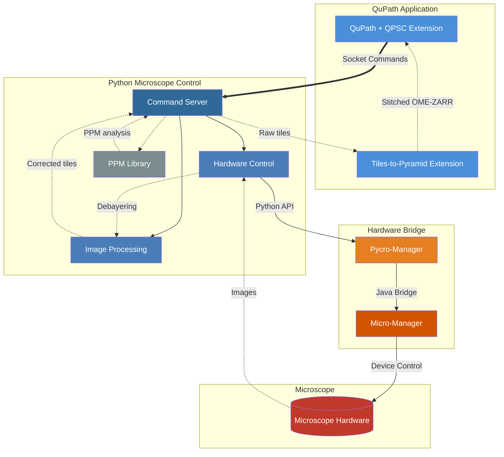
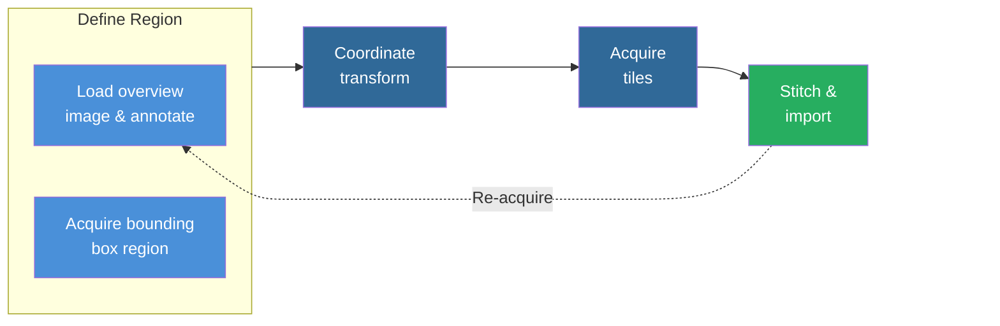
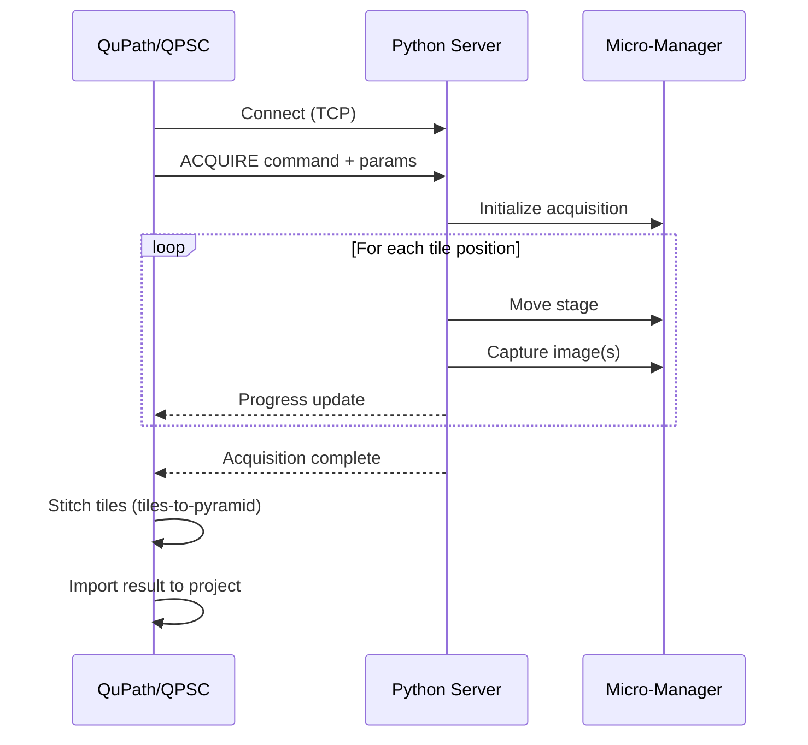

# QPSC - QuPath Scope Control

**Annotation-driven targeted microscopy acquisition from within QuPath**

QPSC bridges [QuPath](https://qupath.github.io/)'s digital pathology environment with automated microscope control via [Micro-Manager](https://micro-manager.org/) and [Pycro-Manager](https://pycro-manager.readthedocs.io/). Users define regions of interest in QuPath and automatically acquire high-resolution microscopy data at those locations.

> **Note:** QPSC requires a microscope with motorized stage, digital camera, and other automated hardware controllable through Micro-Manager device adapters. It does not add automation to manual microscopes.

---

**[→ Installation Instructions](#installation)** | **[→ Set Up Your Microscope](https://github.com/uw-loci/qupath-extension-qpsc/blob/main/documentation/INSTALLATION.md#step-5-create-configuration-files-setup-wizard)** | **[→ Quick Start (Brightfield)](https://github.com/uw-loci/qupath-extension-qpsc/blob/main/documentation/QUICKSTART-BF.md)**

---

## System Overview

> **Click any component** to navigate to its repository or documentation.


```mermaid
flowchart TB
    subgraph QuPath["QuPath Application"]
        direction LR
        QP["QuPath + QPSC Extension"]
        T2P["Tiles-to-Pyramid Extension"]
    end

    subgraph Python["Python Microscope Control"]
        direction LR
        SRV["Command Server"]
        CTRL["Hardware Control"]
        IMP["Image Processing"]
        PPM["PPM Library"]
    end

    subgraph Bridge["Hardware Bridge"]
        direction LR
        PM["Pycro-Manager"]
        MM["Micro-Manager"]
    end

    subgraph Hardware["Microscope"]
        HW[("Microscope Hardware")]
    end

    QP ==>|"Socket Commands"| SRV
    SRV --> CTRL
    SRV --> IMP
    SRV -.-> PPM
    CTRL -->|"Python API"| PM
    PM -->|"Java Bridge"| MM
    MM -->|"Device Control"| HW

    HW -.->|"Images"| CTRL
    CTRL -.->|"Debayering"| IMP
    IMP -.->|"Corrected tiles"| SRV
    PPM -.->|"PPM analysis"| SRV
    SRV -.->|"Raw tiles"| T2P
    T2P -.->|"Stitched OME-ZARR"| QP

    style QP fill:#4A90D9,color:#fff
    style T2P fill:#4A90D9,color:#fff
    style SRV fill:#306998,color:#fff
    style CTRL fill:#4A7DB8,color:#fff
    style IMP fill:#4A7DB8,color:#fff
    style PPM fill:#7B8D8E,color:#fff
    style PM fill:#E67E22,color:#fff
    style MM fill:#D35400,color:#fff
    style HW fill:#C0392B,color:#fff

    click QP "https://github.com/uw-loci/qupath-extension-qpsc" "QPSC Extension Repository"
    click T2P "https://github.com/uw-loci/qupath-extension-tiles-to-pyramid" "Tiles-to-Pyramid Extension Repository"
    click SRV "https://github.com/uw-loci/microscope_command_server" "Command Server Repository"
    click CTRL "https://github.com/uw-loci/microscope_control" "Hardware Control Repository"
    click IMP "https://github.com/uw-loci/microscope_imageprocessing" "Image Processing Repository"
    click PPM "https://github.com/uw-loci/ppm_library" "PPM Library Repository"
    click PM "https://pycro-manager.readthedocs.io/" "Pycro-Manager Documentation"
    click MM "https://micro-manager.org/" "Micro-Manager Website"
```

## Core Workflow


```mermaid
flowchart LR
    subgraph Start["Define Region"]
        direction TB
        Img["Load overview<br/>image & annotate"]
        Acq0["Acquire bounding<br/>box region"]
    end

    Start --> Xform["Coordinate<br/>transform"] --> Acq["Acquire<br/>tiles"] --> Stitch["Stitch &<br/>import"]
    Stitch -.->|"Re-acquire"| Img
    Stitch ~~~ PAD[ ]

    style Img fill:#4A90D9,color:#fff
    style Acq0 fill:#4A90D9,color:#fff
    style Xform fill:#306998,color:#fff
    style Acq fill:#306998,color:#fff
    style Stitch fill:#27AE60,color:#fff
    style PAD fill:none,stroke:none,color:none
```

1. **Setup Coordinates** - Use known/estimated stage coordinates, or load an image from a slide scanner to enable mapping of stage coordinates to locations on the slide
2. **Define Regions** - Draw annotations on areas of interest
3. **Configure Acquisition** - Select imaging modality, objectives, and parameters
4. **Acquire** - The QPSC extension sends a workflow to the microscope command server to capture high-resolution tiles
5. **Stitch & Import** - Tiles are stitched into pyramidal images and imported into the QuPath project with metadata for sorting

*Acquired images can serve as the basis for subsequent targeted acquisitions at higher resolution or with different modalities.*

## Component Repositories

### QuPath Extensions

| Repository | Description | Language |
|------------|-------------|----------|
| [qupath-extension-qpsc](https://github.com/uw-loci/qupath-extension-qpsc) | Main QPSC QuPath extension - UI, workflows, coordinate transforms | Java |
| [qupath-extension-ppm](https://github.com/uw-loci/qupath-extension-ppm) | PPM (Polarized light Microscopy) modality plugin - calibration and analysis workflows for birefringent samples | Java |
| [qupath-extension-tiles-to-pyramid](https://github.com/uw-loci/qupath-extension-tiles-to-pyramid) | Stitches acquired tiles into pyramidal OME-ZARR images | Java |

### Python Microscope Control

| Repository | Description | Language |
|------------|-------------|----------|
| [microscope_command_server](https://github.com/uw-loci/microscope_command_server) | Socket server for QuPath-to-microscope communication and acquisition workflows | Python |
| [microscope_control](https://github.com/uw-loci/microscope_control) | Hardware abstraction layer via Pycromanager/Micro-Manager | Python |
| [microscope_imageprocessing](https://github.com/uw-loci/microscope_imageprocessing) | General image processing: debayering, background correction, TIFF I/O, Z-stack projections | Python |
| [ppm_library](https://github.com/uw-loci/ppm_library) | Polarized light microscopy (PPM) calibration and analysis | Python |
| [microscope_configurations](https://github.com/uw-loci/microscope_configurations) | YAML configuration templates for microscope systems | YAML |

### Supporting Tools

| Repository | Description |
|------------|-------------|
| [qupath-extension-dl-pixel-classifier](https://github.com/uw-loci/qupath-extension-dl-pixel-classifier) | Deep learning pixel classification with embedded Python (UNet, MuViT, ONNX) |
| [qupath-extension-cell-analysis-tools](https://github.com/uw-loci/qupath-extension-cell-analysis-tools) | Python-powered clustering and phenotyping for multiplexed imaging |
| [qupath-extension-ocr4labels](https://github.com/uw-loci/qupath-extension-ocr4labels) | OCR for slide label text extraction |
| [qupath-extension-dialog-manager](https://github.com/uw-loci/qupath-extension-dialog-manager) | Automatic dialog window position tracking and persistence across sessions |
| [qupath-extension-project-metadata-browser](https://github.com/uw-loci/qupath-extension-project-metadata-browser) | Browse, filter, sort, and edit metadata for every image in a QuPath project in a single table view |

## Architecture

QPSC uses a modular architecture with separate Python packages for different concerns:

- **QuPath Extensions** (Java) - User interface, workflows, coordinate transforms
- **Python Microscope Control** - Socket server, hardware abstraction, image processing
- **Micro-Manager Stack** - Hardware device control

For detailed architecture documentation including:
- Component structure and responsibilities
- Communication protocols
- Coordinate system transformations
- Modality system design
- Configuration hierarchy
- Threading and concurrency

See: **[docs/architecture.md](docs/architecture.md)**

## Imaging Modalities

QPSC supports multiple imaging modalities through a pluggable architecture:

| Modality | Description | Status |
|----------|-------------|--------|
| **PPM** (Polarized Light) | Multi-angle polarization microscopy for birefringent samples (via [qupath-extension-ppm](https://github.com/uw-loci/qupath-extension-ppm)) | Active |
| **Brightfield** | Standard transmitted light imaging | Active |
| **Widefield Immunofluorescence** | Multi-channel widefield fluorescence imaging driven by a vendor-agnostic channel library (any ConfigGroup preset or device property can define a channel) | Active |
| **Brightfield + IF (BF+IF)** | Combined BF and fluorescence acquisition on single-camera scopes -- the BF step is expressed as a regular entry in the channel library | Active |
| **Point Scanning** | Laser scanning modalities including two-photon, SHG, and single-photon confocal (via LaserScanningModalityHandler) | Beta |

Learn more about the multi-channel IF and BF+IF design, YAML schema, and an end-to-end worked example in **[docs/multichannel-if-overview.md](docs/multichannel-if-overview.md)**.

## Installation

QPSC requires several components that work together. This section guides you through installing everything needed for annotation-driven microscopy acquisition.

<details open>
<summary><h3>Prerequisites</h3></summary>

**Microscope Hardware Requirements:**

| Component | Status | Purpose |
|-----------|--------|---------|
| Motorized XY stage | **Required** | Tile-based acquisition -- stage moves between positions |
| Motorized Z stage | **Required** | Autofocus (sweep drift check + standard Z-sweep) |
| Image detector | **Required** | Camera or laser scanning detector (Micro-Manager compatible) |
| Rotation stage (PSG) | Recommended (PPM) | Polarizer rotation for multi-angle PPM imaging |
| Motorized objective turret | Optional | Automated objective switching (not yet software-controlled -- manual switch required) |
| Motorized filter wheel | Optional | Filter changes for fluorescence (future modality support) |
| Slide scanner with macro camera | Optional | Overview image for alignment workflow and Stage Map overlay |

All motorized components must be controllable through Micro-Manager device adapters.

Install these foundational **software** components **in this order** before QPSC installation:

#### 1. Micro-Manager (Hardware Control)
- **Version**: 2.0+ (latest 2.0 gamma release recommended)
- **Purpose**: Controls microscope hardware via device adapters
- **Installation**: [Micro-Manager Download](https://micro-manager.org/Download_Micro-Manager_Latest_Release)
- **Configuration**: Configure device adapters for your specific hardware before proceeding. You should be able to move the XY and Z stages and capture images before continuing.
- **Note**: Must be installed and tested before Python packages

#### 2. QuPath (Digital Pathology Platform)
- **Version**: **0.7.0 or newer** -- QPSC declares `v0.7.0` as its target QuPath
  (`SetupScope.java`, `EXTENSION_QUPATH_VERSION`) and the QPSC extension catalog pins the current
  release to `min: v0.7.0`. On QuPath 0.6.x the extension will not load: the setup script still
  copies the JARs, so it looks installed right up until QuPath starts without QPSC in the menu.
- **Purpose**: Annotation interface and image analysis environment
- **Installation**: [QuPath Download](https://qupath.github.io/)
- **Note**: Install before QPSC extensions

#### 3. Python (Microscope Control Server)
- **Version**: Python 3.10-3.12, and **3.12 is the one to pick**. That is not "newest wins" --
  3.12 is the newest version the four Python packages are actually tested against
  (`python-version: ["3.10", "3.11", "3.12"]` in each repo's `.github/workflows/tests.yml`).
  3.13 and 3.14 may well work but nothing has been run against them; `pycromanager` is the
  dependency most likely to object. On an instrument that runs acquisitions, tested beats new.
- **Purpose**: Runtime for microscope control server
- **Windows, Anaconda already installed** (common on scope PCs) -- make a dedicated environment.
  Do **not** upgrade `base`: conda itself lives there, so a half-finished solve leaves you
  repairing conda with conda. A new env is disposable (`conda env remove -n qpsc`).
  ```
  conda create -n qpsc -c conda-forge python=3.12 -y
  conda activate qpsc
  python --version
  ```
- **Windows, no Anaconda**: [Python Download](https://www.python.org/downloads/), and check
  **"Add Python to PATH"** during installation.
- **Note on 3.12 downloads:** 3.12 is in its security-fix-only phase, and 3.12.10 was the last
  release with a binary installer -- python.org will not offer anything newer in the 3.12 line.
  For a fixed instrument environment that is a feature, not a problem: no behaviour churn, and
  security fixes continue until October 2028. But it does mean conda (which ships its own
  maintained 3.12 builds) is the easier route on Windows if you want to stay patched.

#### 4. Windows Media Feature Pack (Windows N/KN Editions Only)

> **Most users can skip this.** Standard Windows editions (Home, Pro, Education) already include these components. Only install if you encounter `ImportError: DLL load failed while importing cv2`.

- **Required for**: Windows N or KN editions (Education N, Pro N, etc.)
- **Purpose**: Provides media codecs required by OpenCV (autofocus functionality)
- **Check if you need this**: Open Settings -> System -> About. If "Edition" ends with "N", you need it.
- **Installation**: [Media Feature Pack Download](https://support.microsoft.com/en-us/topic/media-feature-pack-list-for-windows-n-editions-c1c6fffa-d052-8338-7a79-a4bb980a700a)

#### 5. Java Development Kit (For Extension Development Only)

> **Most users can skip this.** Only needed if you want to build QuPath extensions from source code.

- **Version**: Java 21+
- **Purpose**: Building QuPath extensions from source
- **Installation**: [Adoptium Temurin](https://adoptium.net/)

</details>

<details>
<summary><h3>Automated Installation (Windows - Recommended)</h3></summary>

**Best for most users** - Automated PowerShell script handles all Python package installation, QuPath extensions, and configuration templates.

#### Quick Start (Production Mode)

For users who want to use QPSC without modifying code:

**1. Open PowerShell** (Run as Administrator recommended)

> **Which shell -- this one fails silently.** The setup script is a PowerShell script. Run it
> from `cmd.exe` and Windows will **open it in a text editor instead of running it**, with no
> error and no clue as to why. That is a deliberate Windows default (so double-clicking a
> script cannot execute it), not a fault in the script. **Anaconda Prompt is `cmd`**, so it
> hits this. Check the prompt:
>
> ```
> PS C:\qpsc-extension>          <- PowerShell: correct
> C:\qpsc-extension>             <- cmd: the script will open in an editor
> (base) C:\qpsc-extension>      <- Anaconda Prompt, still cmd
> ```
>
> Anaconda users: choose **Anaconda PowerShell Prompt** from the Start menu, not **Anaconda
> Prompt** -- they are two different entries. Or, from an Anaconda Prompt you already have open
> (which keeps whatever environment you activated), hand just the script to PowerShell:
>
> ```
> powershell -NoProfile -File PPM-QuPath.ps1 -InstallDir "C:\QPSC"
> ```
>
> **PowerShell version:** The script requires PowerShell 5.1+, which is included with Windows 10 and later. You should not need to install anything extra. If you get errors about unrecognized commands, check your version with `$PSVersionTable.PSVersion`.
>
> **Execution policy:** PowerShell blocks the script in two different ways, and the fixes are different. Read which message you got:
>
> - "cannot be loaded because **running scripts is disabled** on this system" -- your policy is `Restricted`. Run `Set-ExecutionPolicy -Scope CurrentUser -ExecutionPolicy RemoteSigned` and try again.
> - "the file ... **is not digitally signed**" -- your policy is already fine; PowerShell is refusing the file because it was downloaded from the internet. Run `Unblock-File .\PPM-QuPath.ps1` and try again. **Do not** change your execution policy for this one, it will not help. If you unpacked a ZIP, clear every file at once with `Get-ChildItem -Recurse | Unblock-File`.
>
> If neither works, see [Setup Script Issues](docs/troubleshooting.md#powershell-execution-policy-error) -- a managed/campus machine may be enforcing a policy you cannot override.

**2. Navigate to your home directory** (avoid System32!):
```powershell
cd $env:USERPROFILE
```

**3. Download the setup script:**
```powershell
Invoke-WebRequest -Uri "https://raw.githubusercontent.com/uw-loci/QPSC/main/PPM-QuPath.ps1" -OutFile "PPM-QuPath.ps1"
```

**4. Run the setup script:**
```powershell
.\PPM-QuPath.ps1
```

**What this does:**
- Creates a Python virtual environment
- Installs Python packages from GitHub (latest versions, including prereleases)
- Installs OpenCV (required for autofocus)
- Downloads QPSC, PPM, and Tiles-to-Pyramid extension JARs (shadow JARs with bundled dependencies)
- Stores extensions in local `QPSC\extensions\` folder for easy access
- Automatically copies extensions to QuPath user data directory
- Downloads configuration templates
- Creates a launcher script that opens server in visible window showing status

**Default installation location:** `C:\Users\YourUsername\QPSC\`

**Custom installation location:**
```powershell
.\PPM-QuPath.ps1 -InstallDir "D:\MyProjects\QPSC"
```

**Custom QuPath location** (if not auto-detected):
```powershell
.\PPM-QuPath.ps1 -QuPathDir "C:\path\to\QuPath-0.7.0"
```

> **Note:** The script automatically searches for QuPath in:
> - `%LOCALAPPDATA%\QuPath-*` (MSI installation default)
> - `%USERPROFILE%\QuPath` (portable installation)
> - `%ProgramFiles%\QuPath`
>
> If QuPath is in a different location, use the `-QuPathDir` parameter.

#### After Installation: Verify Your Setup

**The setup script creates a detailed installation summary file:**

```
%USERPROFILE%\QPSC\INSTALLATION_SUMMARY.txt
```

**This file contains:**
- Python environment location and activation commands
- Exact paths where packages were installed
- Verification commands to test your installation
- Troubleshooting tips for common issues

**Quick verification commands:**

All installations use a virtual environment located at `C:\Users\YourUsername\QPSC\venv_qpsc\`

```powershell
# Activate the virtual environment
C:\Users\YourUsername\QPSC\venv_qpsc\Scripts\Activate.ps1

# Check installed packages
pip list | Select-String "microscope|ppm"

# Test import
python -c "import microscope_command_server; print('Import OK')"
```

**Or use the venv Python directly without activation:**
```powershell
C:\Users\YourUsername\QPSC\venv_qpsc\Scripts\python.exe -c "import microscope_command_server; print('Import OK')"
```

Open the `INSTALLATION_SUMMARY.txt` file to see all available verification commands and troubleshooting steps!

---

<details>
<summary><strong>Development Mode</strong></summary>

For developers who want to modify QPSC code:

**Navigate to your home directory** (if you followed Quick Start above, you're already there):
```powershell
cd $env:USERPROFILE
```

**Download and run in development mode:**
```powershell
.\PPM-QuPath.ps1 -Development
```

**What this does:**
- Clones all 6 QPSC repositories
- Creates Python virtual environment
- Installs packages in editable mode (`pip install -e .`)
- Downloads QuPath extensions
- Sets up development environment

**Detailed setup script documentation:** [SETUP_SCRIPTS_README.md](SETUP_SCRIPTS_README.md)

</details>
</details>

<details>
<summary><h3>Manual Installation (All Platforms)</h3></summary>

**When to use manual installation:**
- macOS or Linux systems
- Prefer manual control over installation process
- Need to customize installation steps
- Automated script fails or is unavailable

#### Prerequisites Check

Before starting, verify you have the required tools installed:

Check Python version (should show 3.10 or higher):
```bash
python --version
```

Check pip is available:
```bash
pip --version
```

Check git is available (for development mode):
```bash
git --version
```

#### Step 1: Create Python Virtual Environment (Recommended)

Using a virtual environment isolates QPSC dependencies from system Python:

**Windows:**

Navigate to an appropriate directory (e.g., your home directory):
```powershell
cd $env:USERPROFILE
```

Create virtual environment:
```powershell
python -m venv qpsc-env
```

Activate virtual environment:
```powershell
.\qpsc-env\Scripts\activate
```

Verify activation (should show path to venv):
```powershell
where python
```

**macOS/Linux:**

Navigate to an appropriate directory (e.g., your home directory):
```bash
cd ~
```

Create virtual environment:
```bash
python3 -m venv qpsc-env
```

Activate virtual environment:
```bash
source qpsc-env/bin/activate
```

Verify activation:
```bash
which python
```

> **Note:** You must activate the virtual environment each time you want to run the microscope server.

#### Step 2: Install Python Packages

**Critical: Installation Order Matters**

These packages have dependencies on each other and must be installed in this exact order:

**Option A: Install from GitHub (Users)**

Installs the latest released versions from GitHub.

**1. Install PPM Library** (no QPSC dependencies):
```bash
pip install git+https://github.com/uw-loci/ppm_library.git
```

**2. Install Microscope Control** (depends on ppm_library):
```bash
pip install git+https://github.com/uw-loci/microscope_control.git
```

**3. Install Microscope Command Server** (depends on both above):
```bash
pip install git+https://github.com/uw-loci/microscope_command_server.git
```

**Option B: Clone and Install Editable (Developers)**

For development and code modification.

Navigate to a parent directory for repositories:
```bash
cd /path/to/your/projects/
```

**Clone and install ppm_library:**
```bash
git clone https://github.com/uw-loci/ppm_library.git
cd ppm_library
pip install -e .
cd ..
```

**Clone and install microscope_control:**
```bash
git clone https://github.com/uw-loci/microscope_control.git
cd microscope_control
pip install -e .
cd ..
```

**Clone and install microscope_command_server:**
```bash
git clone https://github.com/uw-loci/microscope_command_server.git
cd microscope_command_server
pip install -e .
cd ..
```

**Verify installation:**
```bash
pip list | grep -E "(ppm-library|microscope-control|microscope-command-server)"
```

Expected output:
```
microscope-command-server    1.0.0    /path/to/microscope_command_server
microscope-control           1.0.0    /path/to/microscope_control
ppm-library                  1.0.0    /path/to/ppm_library
```

**Troubleshooting:** See the [Python Package Installation](docs/troubleshooting.md#python-package-installation-issues) section of the troubleshooting guide.

#### Step 3: Install QuPath Extensions

Download the latest JAR files from GitHub releases:

1. **QPSC Extension** (main functionality)
   - Navigate to: [qupath-extension-qpsc/releases](https://github.com/uw-loci/qupath-extension-qpsc/releases)
   - Download: `qupath-extension-qpsc-[version].jar`

2. **PPM Extension** (polarized light microscopy modality)
   - Navigate to: [qupath-extension-ppm/releases](https://github.com/uw-loci/qupath-extension-ppm/releases)
   - Download: `qupath-extension-ppm-[version].jar`

3. **Tiles-to-Pyramid Extension** (stitching)
   - Navigate to: [qupath-extension-tiles-to-pyramid/releases](https://github.com/uw-loci/qupath-extension-tiles-to-pyramid/releases)
   - Download: `qupath-extension-tiles-to-pyramid-[version].jar`

**Install extensions:**

Copy all JAR files to QuPath's extensions folder:

- **Windows (MSI install)**: `C:\Users\[YourUsername]\AppData\Local\QuPath-0.7.0\extensions\`
- **Windows (portable)**: `C:\Users\[YourUsername]\QuPath\extensions\`
- **macOS**: `~/Library/Application Support/QuPath/extensions/` or `~/QuPath/extensions/`
- **Linux**: `~/.local/share/QuPath/extensions/` or `~/QuPath/extensions/`

> **Tip:** In QuPath, go to `Edit > Preferences` and look at the "Extension directory" setting to find the exact path on your system.

**Verify installation:**
1. Launch QuPath
2. Go to `Extensions` menu
3. Look for `QPSC` menu entry

If you don't see QPSC in the Extensions menu, check:
- JAR files are in the correct extensions folder
- QuPath was restarted after copying JARs
- Check QuPath's log for any loading errors

#### Step 4: Download Configuration Templates

Configuration files tell the server about your microscope hardware.

**Download from GitHub:**

Navigate to [microscope_configurations](https://github.com/uw-loci/microscope_configurations) and download:

- `templates/config_template.yml` - Main microscope configuration
- `templates/autofocus_template.yml` - Autofocus parameters
- `templates/imageprocessing_template.yml` - Camera/exposure settings
- `resources/resources_LOCI.yml` - Hardware component lookup tables

**Save location:**
Create a `configurations` folder in your project directory, e.g.:
- Windows: `C:\QPSC\configurations\`
- macOS/Linux: `~/QPSC/configurations/`

**Edit for your hardware:**
1. Copy `config_template.yml` to a new file (e.g., `config_mymicroscope.yml`)
2. Edit device names, stage limits, objectives, etc. to match your hardware
3. See [Configuration Documentation](docs/configuration.md) for details

#### Step 5: Start the Microscope Server

Ensure Micro-Manager is running before starting the server.

**From command line:**
```bash
# Activate virtual environment (if using)
# Windows:
.\qpsc-env\Scripts\activate
# macOS/Linux:
source qpsc-env/bin/activate

# Start server
microscope-command-server
```

**Expected output:**
```
INFO - Loading generic startup configuration...
INFO - Initializing Micro-Manager connection...
INFO - Server listening on 0.0.0.0:5000
INFO - Ready for connections...
```

**Server is now ready!** You can connect from QuPath's QPSC extension.

To stop the server: Press `Ctrl+C`

</details>

<details>
<summary><h3>Detailed Component Installation Guides</h3></summary>

For step-by-step instructions with screenshots and troubleshooting, see individual repository READMEs:

| Component | Repository | Installation Guide |
|-----------|------------|-------------------|
| **PPM Library** | [ppm_library](https://github.com/uw-loci/ppm_library) | [Installation](https://github.com/uw-loci/ppm_library#installation) |
| **Microscope Control** | [microscope_control](https://github.com/uw-loci/microscope_control) | [Installation](https://github.com/uw-loci/microscope_control#installation) |
| **Command Server** | [microscope_command_server](https://github.com/uw-loci/microscope_command_server) | [Installation](https://github.com/uw-loci/microscope_command_server#installation) |
| **Configuration Templates** | [microscope_configurations](https://github.com/uw-loci/microscope_configurations) | [Configuration Guide](https://github.com/uw-loci/microscope_configurations#usage) |
| **QPSC Extension** | [qupath-extension-qpsc](https://github.com/uw-loci/qupath-extension-qpsc) | [Extension Docs](https://github.com/uw-loci/qupath-extension-qpsc#installation) |
| **PPM Extension** | [qupath-extension-ppm](https://github.com/uw-loci/qupath-extension-ppm) | [Extension Docs](https://github.com/uw-loci/qupath-extension-ppm#installation) |
| **Stitching Extension** | [qupath-extension-tiles-to-pyramid](https://github.com/uw-loci/qupath-extension-tiles-to-pyramid) | [Extension Docs](https://github.com/uw-loci/qupath-extension-tiles-to-pyramid#installation) |

</details>

<details>
<summary><h3>Troubleshooting</h3></summary>

For installation issues, see the **[Troubleshooting Guide](docs/troubleshooting.md)**:

- [QuPath installation issues](docs/troubleshooting.md#qupath-installation-issues) -- QuPath not found, extensions directory, QPSC not appearing
- [Python package issues](docs/troubleshooting.md#python-package-installation-issues) -- ModuleNotFoundError, OpenCV errors, circular imports
- [Server and network issues](docs/troubleshooting.md#server-and-network-issues) -- port conflicts
- [Setup script issues](docs/troubleshooting.md#setup-script-issues) -- PowerShell execution policy

</details>

<details>
<summary><h3>Post-Installation Verification</h3></summary>

After installation, verify everything works:

#### 1. Test Python Package Imports
```python
python -c "import ppm_library, microscope_control, microscope_command_server; print('All packages imported successfully')"
```

#### 2. Test Server Startup
```bash
# Start Micro-Manager first
# Then start server
microscope-command-server
```

Expected: Server should start and show "Server listening on 0.0.0.0:5000"

#### 3. Test QuPath Extension
1. Launch QuPath
2. Go to `Extensions > QPSC`
3. You should see menu options for workflows

#### 4. Test Full Workflow
See the [Brightfield Quick Start](https://github.com/uw-loci/qupath-extension-qpsc/blob/main/documentation/QUICKSTART-BF.md) or [Laser Scanning Quick Start](https://github.com/uw-loci/qupath-extension-qpsc/blob/main/documentation/QUICKSTART-LSM.md) for workflow walkthroughs

</details>

### Next Steps: Connect to Your Microscope

Software is installed -- now configure QPSC for your specific microscope hardware.

| Step | Guide | What it does |
|------|-------|-------------|
| **1. Create config files** | **[Setup Wizard](https://github.com/uw-loci/qupath-extension-qpsc/blob/main/documentation/INSTALLATION.md#step-5-create-configuration-files-setup-wizard)** | The Setup Wizard (Extensions > QP Scope > Setup Wizard) walks you through creating YAML configuration files that describe your objectives, cameras, stage limits, and imaging modalities. |
| **2. Connect & align** | **[Microscope Alignment](https://github.com/uw-loci/qupath-extension-qpsc/blob/main/documentation/tools/microscope-alignment.md)** | Calibrate the coordinate mapping between QuPath images and your microscope stage. Required once per microscope/scanner combination. |
| **3. First acquisition** | **[Brightfield Quick Start](https://github.com/uw-loci/qupath-extension-qpsc/blob/main/documentation/QUICKSTART-BF.md)** | Step-by-step guide to your first tile acquisition. |

For the complete setup walkthrough: **[Full Installation & Setup Guide](https://github.com/uw-loci/qupath-extension-qpsc/blob/main/documentation/INSTALLATION.md)**

---

### Uninstallation

To remove QPSC components for a clean reinstallation or complete uninstall, see the [Uninstallation Guide](UNINSTALL.md).

---

## Configuration

QPSC uses YAML configuration files for microscope-specific settings:

```yaml
# Example: config_ppm.yml
microscope:
  name: "PPM Microscope"
  stage:
    type: "ASI"
    limits:
      x: [-50000, 50000]
      y: [-50000, 50000]

modalities:
  ppm_20x:
    objective: "20x"
    angles: [0, 45, 90, 135]
    exposure_ms: 50
```

See [Configuration Documentation](docs/configuration.md) for full details.

## Development

### Building from Source

```bash
# Clone the main extension
git clone https://github.com/uw-loci/qupath-extension-qpsc.git
cd qupath-extension-qpsc

# Build (requires Java 21+)
./gradlew build

# Run tests
./gradlew test
```

### Project Structure

For detailed package structure and component documentation, see the **[Architecture Guide](docs/architecture.md)**.

## Communication Protocol

QPSC uses a socket-based protocol for communication between QuPath and the Python server:


```mermaid
sequenceDiagram
    participant QP as QuPath/QPSC
    participant Srv as Python Server
    participant MM as Micro-Manager

    QP->>Srv: Connect (TCP)
    QP->>Srv: ACQUIRE command + params
    Srv->>MM: Initialize acquisition

    loop For each tile position
        Srv->>MM: Move stage
        Srv->>MM: Capture image(s)
        Srv-->>QP: Progress update
    end

    Srv-->>QP: Acquisition complete
    QP->>QP: Stitch tiles (tiles-to-pyramid)
    QP->>QP: Import result to project
```

## Contributing

We welcome contributions! Please see individual repository guidelines:

**QuPath Extensions:**
- [QPSC Extension Issues](https://github.com/uw-loci/qupath-extension-qpsc/issues)
- [Tiles-to-Pyramid Extension](https://github.com/uw-loci/qupath-extension-tiles-to-pyramid)

**Python Microscope Control:**
- [Microscope Command Server Issues](https://github.com/uw-loci/microscope_command_server/issues)
- [Microscope Control Issues](https://github.com/uw-loci/microscope_control/issues)
- [PPM Library Issues](https://github.com/uw-loci/ppm_library/issues)
- [Configuration Templates](https://github.com/uw-loci/microscope_configurations/issues)

## Publications & Citations

If you use QPSC in your research, please cite:

> [Citation information to be added]

## License

Components are licensed individually - see each repository for details.

## Acknowledgments

QPSC is developed at the [Laboratory for Optical and Computational Instrumentation (LOCI)](https://loci.wisc.edu/) at the University of Wisconsin-Madison.

- [QuPath](https://qupath.github.io/) - Open source software for bioimage analysis
- [Micro-Manager](https://micro-manager.org/) - Open source microscopy software
- [Pycro-Manager](https://pycro-manager.readthedocs.io/) - Python interface for Micro-Manager

---

**Questions?** Open an issue in the relevant repository or contact the LOCI team.
