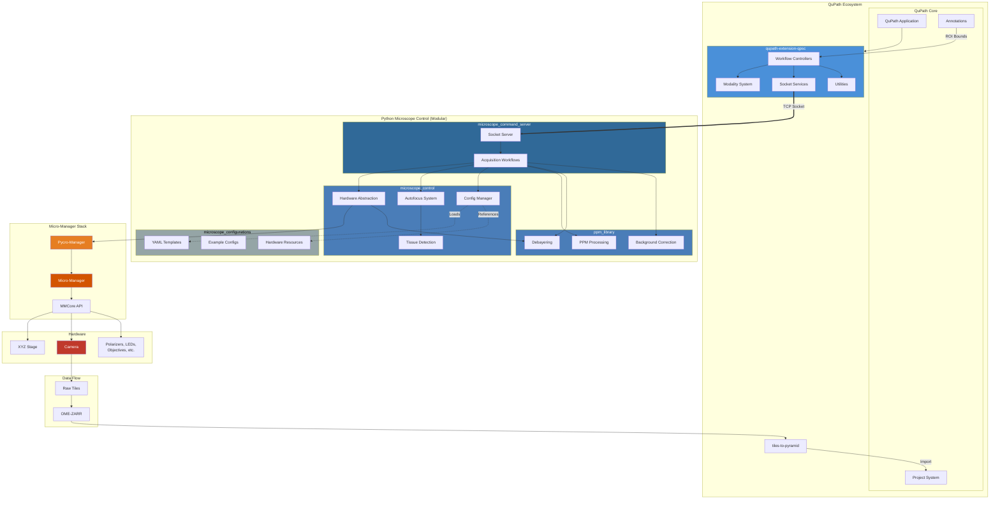
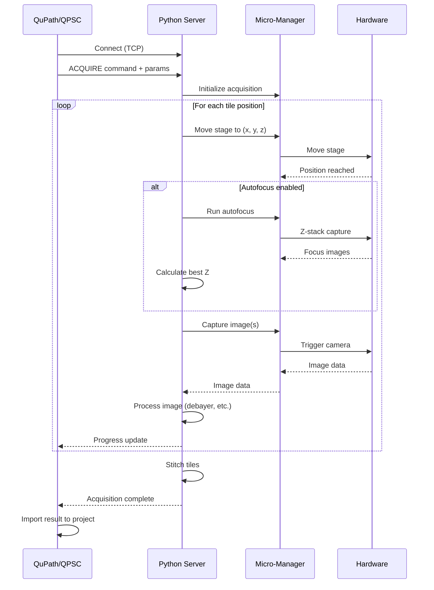

# QPSC Architecture

This document provides a detailed technical architecture overview of the QPSC system.

## System Architecture Overview

QPSC is a modular system consisting of multiple independent components that work together to enable annotation-driven targeted microscopy acquisition from within QuPath.

### High-Level Architecture



## Component Details

### QuPath Extensions (Java)

#### qupath-extension-qpsc

**Purpose:** Main QPSC QuPath extension providing UI, workflows, and coordinate transforms.

**Package Structure:**
```
qupath/ext/qpsc/
├── controller/          # Workflow orchestration
│   ├── QPScopeController.java
│   ├── BoundingBoxWorkflow.java
│   ├── ExistingImageWorkflow.java
│   └── MicroscopeAlignmentWorkflow.java
├── modality/            # Imaging mode plugins
│   ├── ModalityHandler.java
│   ├── ModalityRegistry.java
│   └── ppm/PPMModalityHandler.java
├── service/             # External communication
│   ├── AcquisitionCommandBuilder.java
│   └── microscope/MicroscopeSocketClient.java
├── ui/                  # JavaFX dialogs
│   └── [Dialog controllers]
└── utilities/           # Coordinate transforms, config
    ├── MicroscopeConfigManager.java
    ├── TilingUtilities.java
    └── QPProjectFunctions.java
```

**Key Responsibilities:**
- User interface for all workflows
- Coordinate transformation (QuPath pixel ↔ microscope stage)
- Modality system (pluggable imaging modes)
- Socket communication with Python server
- QuPath project integration

#### qupath-extension-tiles-to-pyramid

**Purpose:** Stitches acquired OME-TIFF microscope tiles into pyramidal image files (OME-TIFF or OME-ZARR) for QuPath.

**Key Responsibilities:**
- Tile stitching algorithms
- Pyramidal image generation (OME-TIFF default, OME-ZARR optional)
- Metadata preservation
- QuPath project import

---

### Python Microscope Control (Modular)

#### microscope_command_server

**Package:** `microscope-server` (pip installable)

**Package Structure:**
```
microscope_server/
├── server/
│   ├── qp_server.py      # TCP/IP socket server
│   └── protocol.py       # Communication protocol
├── acquisition/
│   ├── workflow.py       # Acquisition orchestration
│   ├── tiles.py          # Tile grid utilities
│   ├── pipeline.py       # Processing pipeline
│   └── project.py        # Project management
└── client/
    └── client.py         # Python client library
```

**Key Responsibilities:**
- TCP/IP socket server for QuPath communication
- Acquisition workflow orchestration
- Multi-tile, multi-modality acquisition
- Real-time progress monitoring
- Command parsing and execution

**Dependencies:** `microscope-control`, `ppm-library`

#### microscope_control

**Package:** `microscope-control` (pip installable)

**Package Structure:**
```
microscope_control/
├── hardware/
│   ├── base.py           # Abstract hardware interface
│   └── pycromanager.py   # Micro-Manager implementation
├── autofocus/
│   ├── core.py           # Autofocus algorithms
│   ├── metrics.py        # Focus quality metrics
│   ├── tissue_detection.py  # Empty region detection
│   ├── benchmark.py      # Performance benchmarking
│   └── test.py           # Interactive testing
└── config/
    └── manager.py        # YAML configuration management
```

**Key Responsibilities:**
- Hardware abstraction layer
- Pycromanager/Micro-Manager integration
- XYZ stage positioning
- Autofocus system (multiple algorithms and metrics)
- Tissue detection (avoiding empty regions)
- Configuration management

**Dependencies:** `pycromanager`, `ppm-library` (for debayering)

#### ppm_library

**Package:** `ppm-library` (pip installable)

**Package Structure:**
```
ppm_library/
├── ppm/
│   ├── calibration.py         # Polarizer calibration
│   ├── birefringence_test.py  # Birefringence analysis
│   └── sensitivity_analysis.py
├── imaging/
│   ├── background.py          # Background/flatfield correction
│   ├── tissue_detection.py    # [MOVED to microscope_control]
│   ├── writer.py              # TIFF I/O with metadata
│   └── jai_calibration.py     # JAI camera calibration
└── debayering/
    ├── cpu.py                 # CPU Bayer demosaicing
    ├── gpu.py                 # GPU Bayer demosaicing
    └── verify_gpu.py          # GPU availability check
```

**Key Responsibilities:**
- PPM calibration and processing
- Background/flatfield correction
- Bayer pattern debayering (CPU and GPU)
- TIFF I/O with metadata
- Image processing utilities

**Dependencies:** `numpy`, `scipy`, `scikit-image`, `tifffile`, `opencv-python`

**Note:** This is a standalone library that can be used independently of QPSC.

#### microscope_configurations

**Package Structure:**
```
microscope_configurations/
├── templates/
│   ├── config_template.yml           # Microscope config template
│   ├── autofocus_template.yml        # Autofocus parameters
│   └── imageprocessing_template.yml  # Imaging settings
├── config_PPM.yml                    # Example: PPM microscope
├── config_CAMM.yml                   # Example: CAMM microscope
└── resources/
    └── resources_LOCI.yml            # Hardware component lookup
```

**Key Responsibilities:**
- Configuration templates for new microscopes
- Example configurations
- Shared hardware resource definitions (LOCI)
- YAML schemas and documentation

---

## Communication Protocol

### Socket Communication (QuPath ↔ Python Server)

QPSC uses a TCP/IP socket-based protocol for communication between QuPath (Java) and the Python microscope control server.

**Protocol Flow:**


**Message Format:**
- Commands: Text-based protocol with END_MARKER delimiter
- Progress: Real-time status updates
- Errors: Exception messages propagated to QuPath UI

---

## Coordinate Systems

The QPSC extension handles multiple coordinate systems and transformations:

### Coordinate System Types

1. **QuPath Pixel Coordinates** - Image pixel locations in QuPath viewer
2. **Physical Stage Coordinates** - Microscope stage positions (micrometers)
3. **Tile Grid Coordinates** - Logical tile indices for acquisition

### Transformation Pipeline

```
User Annotation (QuPath pixels)
         ↓
   [Pixel → Physical transform]
         ↓
Physical Bounding Box (μm)
         ↓
   [Apply flip/rotation]
         ↓
Microscope Stage Coordinates
         ↓
   [Generate tile grid]
         ↓
Tile Positions [(x, y, z)]
```

**Key Transformations:**
- Pixel size conversion (pixels → micrometers)
- Image flip handling (Y-axis inversion)
- Rotation compensation
- Stage limit validation
- Tile overlap calculation

---

## Modality System

QPSC supports multiple imaging modalities through a pluggable architecture.

### Modality Handler Interface

Each modality implements `ModalityHandler`:

```java
public interface ModalityHandler {
    List<Double> getAngles();
    List<Integer> getExposures();
    Optional<ModalityUI> createUI();
    List<Double> overrideAngles(Map<String, Object> params);
}
```

### Registered Modalities

- **PPM** (Polarized Light): Multi-angle rotation sequences
- **Brightfield**: Standard transmitted light
- **Fluorescence**: Multi-channel fluorescence (planned)
- **SHG/Multiphoton**: Second harmonic generation (experimental)

### Adding New Modalities

1. Implement `ModalityHandler` interface
2. Register with `ModalityRegistry`
3. Provide angles, exposures, and optional UI
4. Configure in microscope YAML

---

## Data Flow

### Acquisition to Import Pipeline

```
1. User defines ROI in QuPath
         ↓
2. QPSC calculates tile positions
         ↓
3. QuPath sends acquisition command to Python server
         ↓
4. Python server executes multi-tile acquisition
   - For each position:
     - Move stage
     - Run autofocus (if enabled)
     - Capture images (multi-angle for PPM)
     - Debayer raw images
     - Apply background correction
     - Save to disk
         ↓
5. Python server signals completion (tiles saved as OME-TIFF)
         ↓
6. QuPath extension stitches OME-TIFF tiles → Pyramidal OME-TIFF
         ↓
7. QuPath imports stitched image into project
         ↓
8. QuPath applies metadata (sample name, offsets, relationships)
```

**Image Output Formats:**
- **Acquisition tiles**: Individual OME-TIFF files (one per angle/exposure combination)
- **Stitched result**: Pyramidal OME-TIFF files (default) or OME-ZARR (optional)
- **Stitching performed by**: QuPath extension (qupath-extension-tiles-to-pyramid), not Python server

---

## Configuration System

### Hierarchical Configuration

QPSC uses a hierarchical YAML configuration system:

**1. Microscope Configuration** (`config_*.yml`)
- Hardware components (objectives, cameras, stage, etc.)
- Modalities (PPM, brightfield, fluorescence)
- LOCI resource references

**2. Autofocus Configuration** (`autofocus_*.yml`)
- Per-objective autofocus parameters
- Algorithm selection
- Search ranges and step sizes

**3. Image Processing Configuration** (`imageprocessing_*.yml`)
- Per-modality exposure and gain settings
- Camera-specific parameters
- RGB vs raw sensor modes

### Configuration Loading

```python
from microscope_control import ConfigManager

config_mgr = ConfigManager()
settings = config_mgr.get_config('config_PPM')

# Automatically resolves LOCI resource references
# Merges autofocus and imageprocessing configs if present
```

---

## Multi-Sample Project Support

QPSC automatically tracks multiple samples within a single QuPath project:

### Metadata Tracking

- **Image Collections**: Groups related images from the same physical slide
- **XY Offsets**: Physical positions for coordinate transformation
- **Flip Status**: Critical for coordinate system alignment
- **Parent Relationships**: Links between macro images and sub-acquisitions

### Project Structure

```
QuPath Project
├── Sample1/
│   ├── macro_image.ome.zarr
│   ├── region1_ppm.ome.zarr
│   └── region2_brightfield.ome.zarr
└── Sample2/
    ├── macro_image.ome.zarr
    └── region1_ppm.ome.zarr
```

---

## Thread Safety & Concurrency

### QuPath Extension (Java)

- **UI Updates**: Always use `Platform.runLater()` for JavaFX updates
- **Background Acquisition**: Daemon thread pools for long-running operations
- **Modality Registry**: Uses `ConcurrentHashMap` for thread-safe access

### Python Server

- **Socket Server**: Multi-threaded request handling
- **Acquisition**: Single-threaded to ensure hardware synchronization
- **GIL Considerations**: NumPy/OpenCV operations release GIL for parallelism

---

## Error Handling

### Hardware Errors

- Micro-Manager exceptions propagated through Pycromanager
- Stage limit violations prevented before sending commands
- Heartbeat monitoring for long acquisitions

### Network Errors

- Socket timeout handling
- Reconnection logic
- Graceful degradation

### User Errors

- Configuration validation on startup
- Input validation for all user parameters
- Clear error messages in UI

---

## Testing Strategy

### Unit Tests

- **Java**: Coordinate transformations, utilities, configuration parsing
- **Python**: Focus metrics, image processing algorithms, tile grid calculations

### Integration Tests

- Mock hardware for server testing
- Socket protocol testing
- End-to-end workflow validation (with mock hardware)

### Manual Testing

- Hardware integration testing requires physical microscope
- Multi-modal acquisition sequences
- Coordinate alignment verification

---

## Performance Considerations

### Bottlenecks

1. **Stage Movement**: Slowest component (seconds per position)
2. **Autofocus**: Can take 10-30 seconds per position
3. **Image Debayering**: CPU-intensive (GPU acceleration available)
4. **Network Transfer**: Minimal (commands are small, images saved to disk)

### Optimizations

- **Tile Order**: Minimize stage travel distance
- **Autofocus Adaptivity**: Skip autofocus on flat samples
- **GPU Debayering**: 10-50x speedup for large acquisitions
- **Asynchronous I/O**: Overlapping disk writes with acquisition

---

## Security Considerations

- Socket server runs on localhost by default
- No authentication (assumes trusted local network)
- Configuration files may contain hardware-specific details
- No sensitive data stored (microscope settings only)

---

## Future Architecture Considerations

### Potential Enhancements

- **REST API**: Replace socket protocol with HTTP/REST
- **Docker Containers**: Package Python components for easy deployment
- **Cloud Integration**: Remote microscope control
- **Real-time Preview**: Live image streaming to QuPath
- **Distributed Acquisition**: Multi-microscope coordination

---

## References

- [QuPath Documentation](https://qupath.github.io/)
- [Micro-Manager Documentation](https://micro-manager.org/)
- [Pycro-Manager Documentation](https://pycro-manager.readthedocs.io/)
- [OME-ZARR Specification](https://ngff.openmicroscopy.org/)
