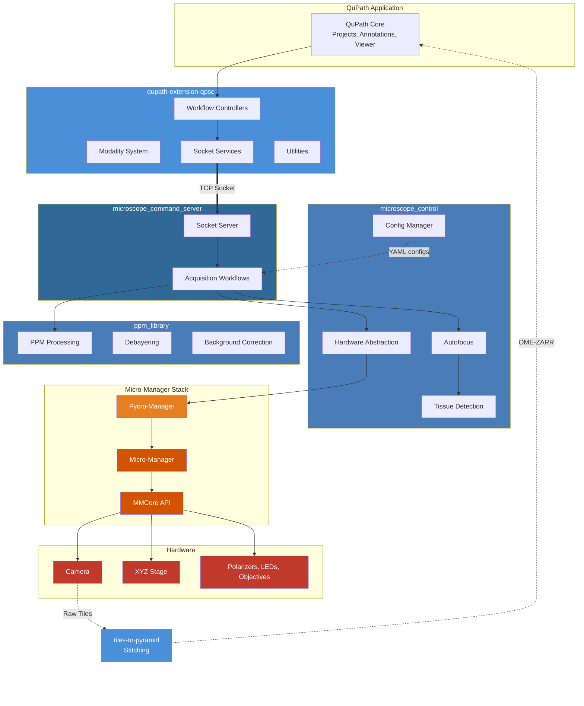
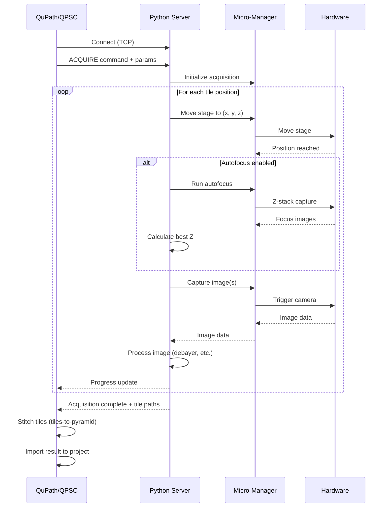

# QPSC Architecture

This document provides a detailed technical architecture overview of the QPSC system.

## System Architecture Overview

QPSC is a modular system consisting of multiple independent components that work together to enable annotation-driven targeted microscopy acquisition from within QuPath.

### High-Level Architecture


```mermaid
flowchart TB
    subgraph QuPathLayer["QuPath Application"]
        QApp["QuPath Core<br/>Projects, Annotations, Viewer"]
    end

    subgraph QPSCLayer["qupath-extension-qpsc"]
        direction LR
        QPSCpad[ ]
        Ctrl["Workflow Controllers"]
        Modal["Modality System"]
        Svc["Socket Services"]
        Utils["Utilities"]
    end

    subgraph ServerLayer["microscope_command_server"]
        direction LR
        QPSrv["Socket Server"]
        AcqEng["Acquisition Workflows"]
    end

    subgraph ControlLayer["microscope_control"]
        direction LR
        HWPy["Hardware Abstraction"]
        AF["Autofocus"]
        TissueDet["Tissue Detection"]
        ConfigMgr["Config Manager"]
    end

    subgraph PPMLayer["ppm_library"]
        direction LR
        PPMProc["PPM Processing"]
        Debayer["Debayering"]
        Imaging["Background Correction"]
    end

    subgraph MMLayer["Micro-Manager Stack"]
        direction LR
        PyCro["Pycro-Manager"]
        MicroM["Micro-Manager"]
        MMCore["MMCore API"]
    end

    subgraph HWLayer["Hardware"]
        direction LR
        Stage["XYZ Stage"]
        Cam["Camera"]
        Extras["Polarizers, LEDs, Objectives"]
    end

    T2P["tiles-to-pyramid<br/>Stitching"]

    QApp --> Ctrl
    Ctrl --> Svc
    Svc ==>|"TCP Socket"| QPSrv
    QPSrv --> AcqEng
    AcqEng --> HWPy
    AcqEng --> AF
    AcqEng --> PPMProc
    AF --> TissueDet
    HWPy --> PyCro
    PyCro --> MicroM
    MicroM --> MMCore
    MMCore --> Stage
    MMCore --> Cam
    MMCore --> Extras

    Cam -.->|"Raw Tiles"| T2P
    T2P -.->|"OME-ZARR"| QApp
    ConfigMgr -.->|"YAML configs"| AcqEng

    HWLayer ~~~ T2P
    T2P ~~~ PAD[ ]

    style QPSCLayer fill:#4A90D9,color:#fff
    style ServerLayer fill:#306998,color:#fff
    style ControlLayer fill:#4A7DB8,color:#fff
    style PPMLayer fill:#4A7DB8,color:#fff
    style T2P fill:#4A90D9,color:#fff
    style PyCro fill:#E67E22,color:#fff
    style MicroM fill:#D35400,color:#fff
    style MMCore fill:#D35400,color:#fff
    style Cam fill:#C0392B,color:#fff
    style Stage fill:#C0392B,color:#fff
    style Extras fill:#C0392B,color:#fff
    style QPSCpad fill:none,stroke:none,color:none
    style PAD fill:none,stroke:none,color:none
```

## Component Details

### QuPath Extensions (Java)

#### qupath-extension-qpsc

**Purpose:** Main QPSC QuPath extension providing UI, workflows, and coordinate transforms.

**Package Structure:**
```
qupath/ext/qpsc/
├── controller/              # Workflow orchestration
│   ├── QPScopeController.java         # Main entry point, routes menu selections
│   ├── BoundedAcquisitionWorkflow.java # Bounding box region acquisition
│   ├── ExistingImageWorkflowV2.java   # Re-acquire annotated regions
│   ├── MicroscopeAlignmentWorkflow.java # Cross-microscope coordinate alignment
│   ├── BackgroundCollectionWorkflow.java
│   ├── WhiteBalanceWorkflow.java
│   ├── AutofocusBenchmarkWorkflow.java
│   ├── AutofocusEditorWorkflow.java
│   ├── TestAutofocusWorkflow.java
│   ├── StackTimeLapseWorkflow.java
│   ├── StitchingRecoveryWorkflow.java
│   ├── AutoRegistrationWorkflow.java
│   ├── ForwardPropagationWorkflow.java
│   ├── NoiseCharacterizationWorkflow.java
│   ├── WBComparisonWorkflow.java
│   ├── MicroscopeController.java
│   └── workflow/            # Shared workflow helpers
│       ├── AcquisitionManager.java
│       ├── AlignmentHelper.java
│       ├── AnnotationHelper.java
│       ├── ProjectHelper.java
│       ├── StitchingHelper.java
│       ├── TileHelper.java
│       ├── TileCleanupHelper.java
│       ├── SingleTileRefinement.java
│       ├── ExistingAlignmentPath.java
│       └── ManualAlignmentPath.java
├── modality/                # Imaging mode plugins
│   ├── ModalityHandler.java           # Plugin interface
│   ├── ModalityRegistry.java          # Runtime registration
│   ├── NoOpModalityHandler.java       # Default/brightfield handler
│   ├── AngleExposure.java             # Angle + exposure pairing
│   ├── ModalityMenuItem.java
│   ├── BackgroundValidationResult.java
│   ├── WbMode.java
│   ├── ppm/                 # PPM modality (tested)
│   │   ├── PPMModalityHandler.java
│   │   ├── PPMPreferences.java
│   │   ├── RotationManager.java
│   │   ├── RotationStrategy.java
│   │   ├── ui/PPMBoundingBoxUI.java
│   │   ├── ui/PPMAngleSelectionController.java
│   │   └── workflow/        # PPM-specific workflows
│   │       ├── PolarizerCalibrationWorkflow.java
│   │       ├── SunburstCalibrationWorkflow.java
│   │       ├── BirefringenceOptimizationWorkflow.java
│   │       └── PPMSensitivityTestWorkflow.java
│   └── multiphoton/         # Multiphoton/SHG handler (untested)
│       └── MultiphotonModalityHandler.java
├── model/                   # Data models
│   ├── SampleSetupResult.java
│   ├── StagePositionProvider.java
│   └── StitchingMetadata.java
├── preferences/             # User preferences
│   ├── PersistentPreferences.java
│   ├── QPPreferenceDialog.java
│   └── FilePropertyItem.java
├── service/                 # External communication
│   ├── AcquisitionCommandBuilder.java
│   ├── AngleResolutionService.java
│   ├── AnnotationOrderingService.java
│   ├── ManualFocusHandler.java
│   ├── microscope/MicroscopeSocketClient.java
│   ├── microscope/MicroscopeHardwareException.java
│   └── notification/        # Event notifications
│       ├── NotificationService.java
│       ├── NotificationEvent.java
│       └── NotificationPriority.java
├── ui/                      # JavaFX dialogs and UI components
│   ├── UIFunctions.java               # Shared UI utilities
│   ├── UnifiedAcquisitionController.java
│   ├── SampleSetupController.java
│   ├── ServerConnectionController.java
│   ├── CameraControlController.java
│   ├── VirtualJoystick.java
│   ├── DualProgressDialog.java
│   ├── liveviewer/          # Live camera viewer
│   │   ├── LiveViewerWindow.java
│   │   ├── HistogramView.java
│   │   ├── StageControlPanel.java
│   │   ├── RefineFocusController.java
│   │   └── SweepFocusController.java
│   ├── stagemap/            # Stage map visualization
│   │   ├── StageMapWindow.java
│   │   ├── StageMapCanvas.java
│   │   ├── StageInsert.java
│   │   └── StageInsertRegistry.java
│   ├── setupwizard/         # Configuration wizard
│   │   ├── SetupWizardDialog.java
│   │   ├── WizardStep.java
│   │   └── [step implementations]
│   └── [additional dialog controllers]
└── utilities/               # Coordinate transforms, config, helpers
    ├── MicroscopeConfigManager.java   # YAML config singleton
    ├── TilingUtilities.java           # Tile grid computation
    ├── QPProjectFunctions.java        # QuPath project management
    ├── TransformationFunctions.java   # Coordinate transforms
    ├── ImageMetadataManager.java      # Multi-sample metadata
    ├── ImageNameGenerator.java        # Filename generation
    ├── AffineTransformManager.java    # Alignment transforms
    ├── StagePositionManager.java      # Named positions
    ├── ImageFlipHelper.java           # Optical flip handling
    ├── ObjectiveUtils.java
    ├── MinorFunctions.java
    ├── VersionInfo.java
    ├── ZFocusPredictionModel.java
    └── [additional utilities]
```

**Key Responsibilities:**
- User interface for all workflows
- Coordinate transformation (QuPath pixel <-> microscope stage)
- Modality system (pluggable imaging modes)
- Socket communication with Python server
- QuPath project integration and metadata tracking

#### qupath-extension-tiles-to-pyramid

**Purpose:** Stitches acquired microscope tiles into pyramidal image files for QuPath.

**Key Responsibilities:**
- Tile stitching from multiple input strategies (filename coordinates, TileConfiguration.txt, Vectra metadata)
- Pyramidal image generation (OME-ZARR default with Blosc compression, OME-TIFF for compatibility)
- Multi-threaded parallel tile writing
- Batch processing with subdirectory matching for multi-angle data
- QuPath project import with metadata

---

### Python Microscope Control (Modular)

#### microscope_command_server

**Package:** `microscope-server` (pip installable)

**Package Structure:**
```
microscope_command_server/
├── server/
│   ├── qp_server.py       # TCP/IP socket server
│   └── protocol.py        # Communication protocol
├── acquisition/
│   ├── workflow.py         # Acquisition orchestration
│   ├── tiles.py            # Tile grid utilities
│   ├── pipeline.py         # Processing pipeline
│   ├── project.py          # Project management
│   └── stack_timelapse.py  # Z-stack and time-lapse acquisition
├── alignment/
│   └── sift_matcher.py     # SIFT-based cross-microscope alignment
├── calibration/
│   └── sunburst_workflow.py # Sunburst calibration automation
├── modality/
│   ├── config.py           # Modality configuration
│   ├── registry.py         # Server-side modality registry
│   ├── ppm.py              # PPM-specific server logic
│   └── shg.py              # SHG/multiphoton server logic (untested)
└── client/
    └── client.py           # Python client library
```

**Key Responsibilities:**
- TCP/IP socket server for QuPath communication
- Acquisition workflow orchestration
- Multi-tile, multi-modality acquisition
- SIFT-based image alignment for cross-microscope workflows
- Real-time progress monitoring
- Command parsing and execution

**Dependencies:** `microscope-control`, `ppm-library`

#### microscope_control

**Package:** `microscope-control` (pip installable)

**Package Structure:**
```
microscope_control/
├── hardware/
│   ├── base.py              # Abstract MicroscopeHardware interface
│   ├── pycromanager.py      # Pycro-Manager/Micro-Manager implementation
│   ├── stage.py             # Stage abstraction
│   ├── rotation.py          # Rotation stage control
│   ├── detector.py          # Detector abstraction
│   ├── illumination.py      # Illumination control
│   └── camera/
│       ├── base.py          # Abstract camera interface
│       ├── pycromanager_camera.py  # Standard MM camera
│       ├── jai_camera.py    # JAI prism camera (per-channel exposure)
│       └── laser_scanning_camera.py # Laser scanning camera (untested)
├── autofocus/
│   ├── core.py              # Autofocus algorithms
│   ├── metrics.py           # Focus quality metrics (13+ options)
│   ├── tissue_detection.py  # Empty region detection
│   ├── benchmark.py         # Autofocus parameter benchmarking
│   └── test.py              # Interactive autofocus testing
├── jai/
│   ├── calibration.py       # JAI camera calibration
│   ├── properties.py        # JAI device properties
│   ├── noise.py             # Noise analysis
│   └── noise_characterization.py  # Noise characterization
└── config/
    └── manager.py           # YAML configuration management
```

**Key Responsibilities:**
- Hardware abstraction layer (MicroscopeHardware interface)
- Pycro-Manager/Micro-Manager integration
- XYZ stage positioning with limit validation
- Camera abstraction including JAI prism cameras
- Autofocus system (multiple algorithms and 13+ focus metrics)
- Tissue detection (skipping empty regions)
- Configuration management with LOCI resource resolution

**Dependencies:** `pycromanager`, `ppm-library` (for debayering)

#### ppm_library

**Package:** `ppm-library` (pip installable)

**Package Structure:**
```
ppm_library/
├── ppm/
│   ├── birefringence_test.py      # Birefringence analysis
│   ├── polarizer_calibration.py   # Polarizer extinction calibration
│   ├── sensitivity_analysis.py    # PPM sensitivity analysis
│   └── sensitivity_test.py        # Sensitivity testing
├── imaging/
│   ├── background.py              # Background/flatfield correction
│   ├── writer.py                  # TIFF I/O with metadata
│   ├── hue_correction.py          # Hue-based corrections
│   └── ppm_image.py               # PPM image handling
├── analysis/
│   ├── region_analysis.py         # Region-based analysis
│   ├── surface_analysis.py        # Surface analysis
│   ├── workflow.py                # Analysis workflow
│   └── cli.py                     # Command-line interface
├── calibration/
│   ├── radial.py                  # Radial calibration (sunburst)
│   └── histogram_correction.py    # Histogram correction
└── debayering/
    ├── cpu.py                     # CPU Bayer demosaicing
    └── gpu.py                     # GPU-accelerated demosaicing
```

**Key Responsibilities:**
- PPM polarizer calibration and processing
- Background/flatfield correction
- Bayer pattern debayering (CPU and GPU)
- Birefringence analysis and hue correction
- Radial calibration (sunburst target)
- TIFF I/O with metadata

**Dependencies:** `numpy`, `scipy`, `scikit-image`, `tifffile`, `opencv-python`

**Note:** This is a standalone library that can be used independently of QPSC.

#### microscope_configurations

**Package Structure:**
```
microscope_configurations/
├── templates/
│   ├── config_template.yml           # Microscope config template
│   ├── autofocus_template.yml        # Autofocus parameters
│   └── imageprocessing_template.yml  # Imaging settings
├── config_PPM.yml                    # PPM microscope configuration
├── config_CAMM.yml                   # CAMM microscope configuration
├── config_Ocus40.yml                 # Ocus40 slide scanner
├── autofocus_PPM.yml                 # PPM autofocus settings
├── imageprocessing_PPM.yml           # PPM image processing settings
└── resources/
    └── resources_LOCI.yml            # Shared hardware component lookup
```

**Key Responsibilities:**
- Configuration templates for new microscopes
- Working microscope configurations
- Shared hardware resource definitions (LOCI)

---

## Communication Protocol

### Socket Communication (QuPath <-> Python Server)

QPSC uses a TCP/IP socket-based protocol for communication between QuPath (Java) and the Python microscope control server.

**Protocol Flow:**

```mermaid
sequenceDiagram
    participant QP as QuPath/QPSC
    participant Srv as Python Server
    participant MM as Micro-Manager
    participant HW as Hardware

    QP->>Srv: Connect (TCP)
    QP->>Srv: ACQUIRE command + params
    Srv->>MM: Initialize acquisition

    loop For each tile position
        Srv->>MM: Move stage to (x, y, z)
        MM->>HW: Move stage
        HW-->>MM: Position reached

        alt Autofocus enabled
            Srv->>MM: Run autofocus
            MM->>HW: Z-stack capture
            HW-->>MM: Focus images
            Srv->>Srv: Calculate best Z
        end

        Srv->>MM: Capture image(s)
        MM->>HW: Trigger camera
        HW-->>MM: Image data
        MM-->>Srv: Image data

        Srv->>Srv: Process image (debayer, etc.)
        Srv-->>QP: Progress update
    end

    Srv-->>QP: Acquisition complete + tile paths
    QP->>QP: Stitch tiles (tiles-to-pyramid)
    QP->>QP: Import result to project
```

**Message Format:**
- Commands: Fixed-length (8-byte) big-endian encoded with 41 defined command types
- Progress: Real-time status updates
- Errors: Exception messages propagated to QuPath UI
- Heartbeat: Connection health monitoring during long acquisitions

---

## Coordinate Systems

The QPSC extension handles multiple coordinate systems and transformations:

### Coordinate System Types

1. **QuPath Pixel Coordinates** - Image pixel locations in QuPath viewer
2. **Physical Stage Coordinates** - Microscope stage positions (micrometers)
3. **Tile Grid Coordinates** - Logical tile indices for acquisition

### Transformation Pipeline

```
User Annotation (QuPath pixels)
         |
   [Pixel -> Physical transform]
         |
Physical Bounding Box (um)
         |
   [Apply flip/inversion]
         |
Microscope Stage Coordinates
         |
   [Generate tile grid]
         |
Tile Positions [(x, y, z)]
```

**Key Transformations:**
- Pixel size conversion (pixels -> micrometers)
- Optical flip handling (image inversion from light path -- see CLAUDE.md for flip vs invert distinction)
- Stage axis inversion (configuration property of stage controller)
- Affine alignment transform (for cross-microscope workflows)
- Stage limit validation
- Tile overlap calculation

---

## Modality System

QPSC supports multiple imaging modalities through a pluggable architecture.

### Modality Handler Interface

Each modality implements `ModalityHandler`. Key methods:

```java
public interface ModalityHandler {
    // Core: returns angle/exposure pairs for the modality
    CompletableFuture<List<AngleExposure>> getRotationAngles(
        String modalityName, String objective, String detector);

    // Optional UI for modality-specific parameters
    default Optional<BoundingBoxUI> createBoundingBoxUI();

    // Apply user overrides to the default angle set
    default List<AngleExposure> applyAngleOverrides(
        List<AngleExposure> angles, Map<String, Double> overrides);

    // Additional defaults: getImageType(), getAngleSuffix(),
    // getPostProcessingDirectorySuffixes(), validateBackgroundSettings(),
    // getMenuContributions(), configureCommandBuilder(), etc.
}
```

### Registered Modalities

| Modality | Handler | Status |
|----------|---------|--------|
| **PPM** (Polarized Light) | `PPMModalityHandler` | Tested and validated |
| **Brightfield** | `NoOpModalityHandler` | Tested (single-angle, no rotation) |
| **Multiphoton/SHG** | `MultiphotonModalityHandler` | Code exists, untested on hardware |
| **Widefield Fluorescence** | -- | Planned |

### Adding New Modalities

1. Implement `ModalityHandler` interface
2. Register with `ModalityRegistry` (keyed by prefix string)
3. Provide rotation angles/exposures via `getRotationAngles()`
4. Optionally provide custom UI via `createBoundingBoxUI()`
5. Configure acquisition profiles in microscope YAML

---

## Data Flow

### Acquisition to Import Pipeline

```
1. User defines ROI in QuPath
         |
2. QPSC calculates tile positions
         |
3. QuPath sends acquisition command to Python server via socket
         |
4. Python server executes multi-tile acquisition
   - For each position:
     - Move stage
     - Run autofocus (if enabled)
     - Capture images (multi-angle for PPM)
     - Debayer raw images (if Bayer sensor)
     - Apply background correction
     - Save tiles to disk as OME-TIFF
         |
5. Python server signals completion
         |
6. QuPath extension (tiles-to-pyramid) stitches tiles into
   pyramidal OME-ZARR (default) or OME-TIFF
         |
7. QuPath imports stitched image into project
         |
8. QuPath applies metadata (sample name, offsets, parent relationships)
```

**Image Output Formats:**
- **Acquisition tiles**: Individual OME-TIFF files (one per angle per tile position)
- **Stitched result**: Pyramidal OME-ZARR (default, multi-threaded, Blosc compression) or OME-TIFF
- **Stitching performed by**: QuPath extension (qupath-extension-tiles-to-pyramid), not the Python server

---

## Configuration System

### Hierarchical Configuration

QPSC uses a hierarchical YAML configuration system:

**1. Microscope Configuration** (`config_*.yml`)
- Hardware components (objectives, cameras, stage, rotation stage, etc.)
- Modalities and acquisition profiles
- LOCI resource references (for shared hardware across microscopes)

**2. Autofocus Configuration** (`autofocus_*.yml`)
- Per-objective autofocus parameters
- Focus metric selection
- Search ranges and step sizes

**3. Image Processing Configuration** (`imageprocessing_*.yml`)
- Per-modality exposure and gain settings
- Camera-specific parameters (JAI per-channel, standard)
- White balance and background correction settings

`MicroscopeConfigManager` (Java) and `ConfigManager` (Python) provide type-safe access with automatic resource resolution for LOCI references.

---

## Multi-Sample Project Support

QPSC automatically tracks multiple samples within a single QuPath project:

### Metadata Tracking

- **Image Collections**: Groups related images from the same physical slide
- **XY Offsets**: Physical positions for coordinate transformation
- **Flip Status**: Optical flip state for coordinate alignment
- **Parent Relationships**: Links between macro images and sub-acquisitions

### Project Structure

```
QuPath Project
├── Sample1/
│   ├── macro_image.ome.zarr
│   ├── region1_ppm.ome.zarr
│   └── region2_brightfield.ome.zarr
└── Sample2/
    ├── macro_image.ome.zarr
    └── region1_ppm.ome.zarr
```

---

## Thread Safety & Concurrency

### QuPath Extension (Java)

- **UI Updates**: Always use `Platform.runLater()` for JavaFX updates
- **Background Acquisition**: Daemon thread pools for long-running operations
- **Modality Registry**: Uses `ConcurrentHashMap` for thread-safe access

### Python Server

- **Socket Server**: Multi-threaded request handling
- **Acquisition**: Single-threaded to ensure hardware synchronization
- **GIL Considerations**: NumPy/OpenCV operations release GIL for parallelism

---

## Error Handling

### Hardware Errors

- Micro-Manager exceptions propagated through Pycro-Manager
- Stage limit violations prevented before sending commands
- Heartbeat monitoring for long acquisitions

### Network Errors

- Socket timeout handling
- Reconnection logic
- Graceful degradation

### User Errors

- Configuration validation on startup (`QPScopeChecks.validateMicroscopeConfig()`)
- Input validation for all user parameters
- Clear error messages in QuPath UI

---

## Testing Strategy

### Unit Tests

- **Java**: Coordinate transformations, utilities, configuration parsing (requires JavaFX modules)
- **Python**: Focus metrics, image processing algorithms, tile grid calculations

### Integration Tests

- Mock hardware for server testing
- Socket protocol testing
- End-to-end workflow validation (with mock hardware)

### Manual Testing

- Hardware integration testing requires physical microscope
- Multi-modal acquisition sequences
- Coordinate alignment verification

---

## Performance Considerations

### Bottlenecks

1. **Stage Movement**: Slowest component (seconds per position)
2. **Autofocus**: Can take 10-30 seconds per position (adaptive strategy reduces this)
3. **Image Debayering**: CPU-intensive (GPU option available in ppm_library)
4. **Network Transfer**: Minimal (commands are small, images saved to disk)

### Optimizations

- **Tile Order**: Serpentine path to minimize stage travel distance
- **Adaptive Autofocus**: Full search at first position, reduced range thereafter
- **Tissue Detection**: Skip autofocus and acquisition on blank regions
- **OME-ZARR**: Multi-threaded parallel tile writing (2-3x faster than OME-TIFF)

---

## Future Architecture Considerations

- **Appose integration**: Replace socket-based Python server with embedded Python via Appose, collapsing the three-process architecture to a single QuPath application
- **PyMMCore+ backend**: Direct Python bindings to CMMCore without requiring a running Micro-Manager GUI process
- **Additional modalities**: Widefield fluorescence, point scanning (two-photon, SHG, confocal)

---

## References

- [QuPath Documentation](https://qupath.github.io/)
- [Micro-Manager Documentation](https://micro-manager.org/)
- [Pycro-Manager Documentation](https://pycro-manager.readthedocs.io/)
- [OME-ZARR Specification](https://ngff.openmicroscopy.org/)
