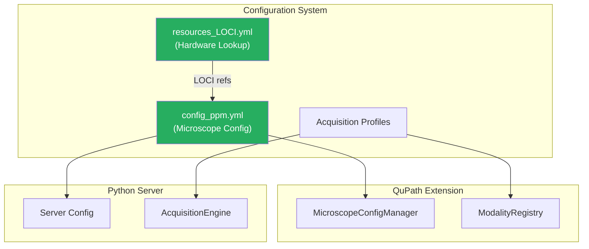

# QPSC Configuration Guide

QPSC uses YAML configuration files to define microscope hardware, imaging modalities, and acquisition profiles.

## Configuration Files

| File | Purpose | Location |
|------|---------|----------|
| `config_<microscope>.yml` | Microscope-specific hardware and modality settings | `smartpath_configurations/` |
| `resources_LOCI.yml` | Shared hardware component lookup tables | `smartpath_configurations/` |
| Acquisition Profiles | Pre-defined acquisition parameter sets | Within config files |

## Configuration Hierarchy



## Microscope Configuration

### Basic Structure

```yaml
# config_ppm.yml - Example PPM microscope configuration

microscope:
  name: "PPM Scope"
  description: "Polarized light microscopy system"

  # Stage configuration
  stage:
    type: "ASI"
    controller: "MS2000"
    limits:
      x_min: -50000
      x_max: 50000
      y_min: -50000
      y_max: 50000
      z_min: 0
      z_max: 10000

  # Camera configuration
  camera:
    name: "Hamamatsu ORCA"
    pixel_size_um: 6.5
    sensor_width: 2048
    sensor_height: 2048

  # Objective turret
  objectives:
    - name: "4x"
      magnification: 4
      na: 0.13
      pixel_size_um: 1.625
    - name: "20x"
      magnification: 20
      na: 0.75
      pixel_size_um: 0.325
```

### Modality Configuration

```yaml
modalities:
  # Polarized light microscopy
  ppm_20x:
    type: "ppm"
    objective: "20x"
    description: "PPM at 20x magnification"

    # Polarizer rotation angles
    angles: [0, 45, 90, 135]

    # Exposure settings
    exposure_ms: 50

    # LED/illumination
    illumination:
      type: "LED"
      intensity: 80

    # Tile overlap for stitching
    overlap_percent: 10

  # Standard brightfield
  brightfield_4x:
    type: "brightfield"
    objective: "4x"
    exposure_ms: 20
    overlap_percent: 15
```

### Hardware References (LOCI Lookup)

The configuration system supports references to shared hardware definitions:

```yaml
# In config_ppm.yml
stage:
  $ref: "LOCI:stages/ASI_MS2000"

# In resources_LOCI.yml
stages:
  ASI_MS2000:
    type: "ASI"
    controller: "MS2000"
    speed_um_s: 10000
    acceleration: 100
```

## Acquisition Profiles

Acquisition profiles define complete parameter sets for specific imaging scenarios:

```yaml
acquisition_profiles:
  - name: "High Resolution PPM"
    modality: "ppm_20x"
    tile_size: 2048
    overlap_percent: 15
    autofocus:
      enabled: true
      method: "contrast"
      interval_tiles: 10
    z_stack:
      enabled: false

  - name: "Quick Survey"
    modality: "brightfield_4x"
    tile_size: 2048
    overlap_percent: 10
    autofocus:
      enabled: true
      method: "hardware"
      interval_tiles: 25
```

## Server Configuration

The Python server reads configuration for socket communication and hardware control:

```yaml
server:
  host: "localhost"
  port: 5000
  timeout_s: 300

  # Heartbeat for long acquisitions
  heartbeat:
    enabled: true
    interval_s: 5

  # Output paths
  output:
    base_path: "/data/acquisitions"
    format: "ome-zarr"
    compression: "zstd"
```

## Coordinate System Configuration

Define the relationship between QuPath coordinates and stage coordinates:

```yaml
coordinate_system:
  # Origin location
  origin: "top_left"

  # Axis directions (1 or -1)
  x_direction: 1
  y_direction: -1

  # Flip settings for macro images
  flip_horizontal: false
  flip_vertical: true

  # Stage-to-pixel transform (set during alignment)
  calibration:
    scale_x: 0.325  # um per pixel
    scale_y: 0.325
    offset_x: 0
    offset_y: 0
```

## Loading Configuration in Code

### Java (QuPath Extension)

```java
// Get the singleton config manager
MicroscopeConfigManager config = MicroscopeConfigManager.getInstance();

// Load configuration
config.loadConfiguration("/path/to/config_ppm.yml");

// Access values
String microscopeName = config.getString("microscope.name");
List<Double> angles = config.getDoubleList("modalities.ppm_20x.angles");
double pixelSize = config.getDouble("microscope.objectives[1].pixel_size_um");
```

### Python (Server)

```python
from smart_wsi_scanner.config import load_config

# Load configuration
config = load_config("/path/to/config_ppm.yml")

# Access values
microscope_name = config["microscope"]["name"]
angles = config["modalities"]["ppm_20x"]["angles"]
```

## Validation

QPSC validates configuration on startup. Common validation checks:

- Required fields present (microscope name, stage limits)
- Modality references valid objectives
- Stage limits are sensible (min < max)
- Port numbers in valid range
- File paths exist (where applicable)

If validation fails, QPSC workflows are disabled and an error is displayed.

## Example Configurations

Complete example configurations are available in the [smartpath_configurations](https://github.com/uw-loci/smartpath_configurations) repository:

- `config_ppm.yml` - PPM microscope at LOCI
- `config_brightfield.yml` - Standard brightfield system
- `resources_LOCI.yml` - Shared hardware definitions

## Troubleshooting

### Configuration Not Loading

1. Check file path is correct
2. Verify YAML syntax (use a YAML validator)
3. Check QuPath log for specific error messages

### Hardware Not Responding

1. Verify Micro-Manager can control hardware directly
2. Check port/connection settings in config
3. Ensure device adapters are loaded in Micro-Manager

### Coordinate Mismatch

1. Run the Microscope Alignment workflow
2. Verify flip settings match your setup
3. Check axis direction signs

---

See also:
- [QuPath Extension Documentation](https://github.com/uw-loci/qupath-extension-qpsc)
- [Smart-WSI-Scanner Documentation](https://github.com/JenuC/smart-wsi-scanner)
